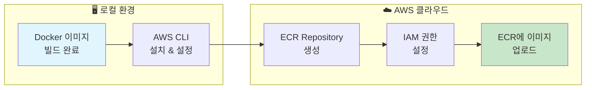
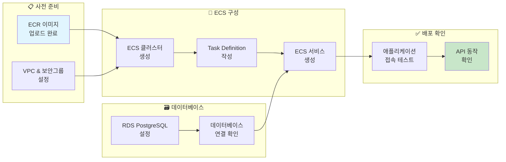

# Phase 3: Spring Boot 애플리케이션 Docker 컨테이너화 및 ECR 업로드

## 개요
AWS 환경에 대응된 Spring Boot 애플리케이션을 Docker 컨테이너로 패키징하고, Amazon ECR(Elastic Container Registry)에 업로드한다. 또한 ECS 클러스터와 태스크 정의를 생성하여 배포 준비를 완료한다.

### 💰 프리티어 및 비용 안내
이 실습에서 사용하는 AWS 서비스들의 프리티어 및 비용 정보다:

**✅ 프리티어 범위 내 서비스:**
- **ECR 스토리지**: 500MB/월 (1년간 무료)
- **ECS Fargate**: 매월 20GB-시간의 스토리지, 5GB의 이시드 스토리지
- **CloudWatch Logs**: 5GB/월 무료
- **데이터 전송**: 15GB/월 아웃바운드 무료

**⚠️ 비용 발생 가능 서비스:**
- **ECR 이미지 스캔**: 비활성화 권장 (활성화 시 이미지당 $0.09)
- **ECS Fargate 시간**: 프리티어 한도 초과 시 시간당 요금 발생
- **RDS**: 별도 Phase에서 다룰 예정 (t3.micro 750시간/월 무료)
- **퍼블릭 IP**: 사용하지 않을 때 요금 발생 방지를 위해 리소스 정리 필요

> **💡 비용 절약 팁**: 실습 완료 후 생성한 리소스들을 삭제하여 불필요한 비용 발생을 방지한다.

---

## 1. Spring Boot 애플리케이션 배포 준비

### 1-1. IntelliJ IDEA - 배포용 애플리케이션 설정
#### 1-1-1. Spring Boot Actuator 의존성 추가

**build.gradle에 Actuator 의존성 추가**
```gradle
dependencies {
    implementation 'org.springframework.boot:spring-boot-starter-data-jpa'
    implementation 'org.springframework.boot:spring-boot-starter-web'
    implementation 'org.springframework.boot:spring-boot-starter-actuator'  // 추가
    developmentOnly 'org.springframework.boot:spring-boot-devtools'
    runtimeOnly 'org.postgresql:postgresql'
    // ... 기타 의존성들
}
```

> **💡 Spring Boot Actuator**: 애플리케이션의 상태 모니터링, 메트릭 수집, 헬스체크 등의 기능을 제공하는 
> Spring Boot의 프로덕션 준비 기능이다. ECS에서 컨테이너 상태 확인과 자동 복구에 필수적이다.

#### 1-1-2. application.yaml 환경 설정 최적화

**AWS 프로파일을 기본값으로 설정**
```yaml
spring:
  profiles:
    active: aws  # 기본 프로파일을 aws로 설정
```

**Spring Boot Actuator 헬스체크 엔드포인트 설정**
```yaml
# Spring Boot Actuator 설정
management:
  endpoints:
    web:
      exposure:
        include: health,info,metrics
  endpoint:
    health:
      show-details: when-authorized
      show-components: always
```

**Spring Boot Actuator 설정 상세 설명:**
- **management.endpoints.web.exposure.include**: 외부에서 접근할 수 있는 액추에이터 엔드포인트를 지정한다.
  - `health`: 애플리케이션의 생존 여부와 각 구성 요소의 상태 확인
  - `info`: 애플리케이션 정보 (버전, 빌드 정보 등) 제공
  - `metrics`: 애플리케이션 메트릭 정보 제공
- **management.endpoint.health.show-details**: 헬스체크 결과의 상세 정보 표시 수준을 설정한다.
  - `when-authorized`: 인증된 사용자에게만 상세 정보 표시 (보안 고려)
  - `always`: 모든 사용자에게 상세 정보 표시 (개발/테스트 환경)
- **management.endpoint.health.show-components**: 각 헬스 인디케이터 컴포넌트의 상태를 개별적으로 표시한다.
  - 데이터베이스, 디스크 공간, 외부 서비스 연결 상태 등을 구분하여 확인 가능

**얻을 수 있는 인사이트:**
- ECS의 헬스체크 기능과 연동하여 애플리케이션 문제 시 자동 복구 가능
- 운영 중 데이터베이스 연결, 외부 서비스 연결 상태를 실시간 모니터링 가능
- 로드밸런서가 트래픽을 라우팅할 때 건강한 인스턴스만 선택하도록 도움

#### 1-1-3. Dockerfile 작성

**멀티플랫폼 지원을 위한 베이스 이미지 선택**
```dockerfile
# 1단계: Gradle 빌드 환경 (멀티플랫폼 지원)
FROM eclipse-temurin:17-jdk as builder

# 작업 디렉토리 설정
WORKDIR /app

# Gradle Wrapper와 설정 파일 복사
COPY gradlew .
COPY gradle gradle
COPY build.gradle .
COPY settings.gradle .

# 소스 코드 복사
COPY src src

# 애플리케이션 빌드 (bootJar 사용)
RUN ./gradlew bootJar

# 2단계: 실행 환경 (최적화된 런타임)
FROM eclipse-temurin:17-jre

# 작업 디렉토리 설정
WORKDIR /app

# 빌드된 JAR 파일 복사
COPY --from=builder /app/build/libs/*.jar app.jar

# 포트 노출
EXPOSE 8080

# 애플리케이션 실행
ENTRYPOINT ["java", "-jar", "app.jar"]
```

**크로스 플랫폼 빌드 고려사항:**
- **eclipse-temurin:17**: OpenJDK 기반으로 AMD64(Intel/AMD)와 ARM64(Apple Silicon) 모두 공식 지원
- **alpine 대신 일반 Linux 베이스**: Alpine Linux는 ARM64 지원이 제한적이므로 표준 Linux 배포판 사용
- **멀티 스테이지 빌드**: 빌드 환경과 실행 환경을 분리하여 최종 이미지 크기 최적화
- **AWS EC2 호환성**: EC2는 x86_64(AMD64) 아키텍처이므로 ARM64 Mac에서는 플랫폼 지정 필요

**build vs bootJar의 차이점:**
- **gradle build** : 전체 프로젝트 빌드 (컴파일, 테스트, JAR 생성, 문서 생성 등 모든 태스크 실행)
  - 유스케이스 : 개발 중 전체 검증이 필요한 경우
  - 시간 : 더 오래 걸림 (테스트 실행 포함)
- **gradle bootJar** : Spring Boot 실행 가능한 JAR만 생성 (테스트 생략)
  - 유스케이스 : 배포용 JAR가 빠르게 필요한 경우, Docker 빌드 시간 단축
  - 시간 : 빠름 (테스트 건너뛰기)

### 1-2. 로컬 Docker 빌드 및 테스트

#### 목적 및 개요
이 단계의 **핵심 목적은 AWS 배포를 위한 Docker 이미지를 성공적으로 빌드하는 것**이다. **중요한 점은 로컬에서의 완전한 애플리케이션 테스트는 하지 않는다는 것**이다. 왜냐하면:

1. **환경 차이**: 로컬과 AWS 환경의 데이터베이스, S3, 네트워킹 설정이 다름
2. **복잡성 증가**: 로컬 테스트를 위한 추가 설정이 AWS 학습 목표를 흐림  
3. **실제 운영 방식**: 실제 개발에서도 로컬 완전 테스트보다는 staging/production 환경에서 테스트

따라서 이 단계에서는 **"Docker 이미지가 빌드되고 컨테이너가 시작되는가?"**만 확인하고, **실제 기능 테스트는 AWS 환경에서 진행**한다.

#### 1-2-1. 플랫폼별 Docker 이미지 빌드

**사용자 환경에 따른 최적화된 빌드 방법:**

**Windows (Intel/AMD) & Mac Intel 사용자:**
```bash
# AWS EC2와 동일한 AMD64 아키텍처이므로 일반 빌드 사용 (빠르고 효율적)
docker build -t chap02-aws-deploy:latest .
```

**Mac Apple Silicon 사용자:**
```bash
# AWS EC2 배포를 위해 AMD64 플랫폼 지정 필수
docker buildx build --platform linux/amd64 -t chap02-aws-deploy:latest .
```

**모든 환경 호환용 (선택사항):**
```bash
# 멀티플랫폼 이미지 빌드 (시간이 더 오래 걸림)
docker buildx build --platform linux/amd64,linux/arm64 -t chap02-aws-deploy:latest .
```

#### 1-2-2. 로컬 컨테이너 실행 테스트

**목적**: Docker 이미지가 정상적으로 빌드되어 컨테이너가 시작되는지만 확인

```bash
# 간단한 실행 테스트 (포트 충돌 방지를 위해 8081 사용)
docker run -d -p 8081:8080 --name test-container chap02-aws-deploy:latest

# 컨테이너 상태 확인
docker ps

# 로그 확인 (몇 초 정도만)
docker logs test-container

# 정리
docker rm -f test-container
```

**예상 결과**:
- 컨테이너가 시작됨 ✅
- Spring Boot 로고와 시작 로그가 보임 ✅  
- **AWS 관련 오류가 발생할 수 있음** (정상적인 상황)
  - S3 자격증명 없음
  - RDS 연결 없음
  - 이는 **예상된 상황**이며, AWS 환경에서 해결됨

**핵심**: 
> "로컬에서 AWS 서비스 관련 오류가 발생하는 것은 정상이다. 중요한 것은 Docker 이미지가 성공적으로 빌드되었다는 점이며, 실제 동작은 AWS 환경에서 확인할 것이다."

---

## 2. ECR 시작하기

> 💡 ECR 작업 개요
> ECR(Elastic Container Registry)은 AWS의 컨테이너 이미지 저장소다. 위 다이어그램에서 보시는 것처럼, 우리는 로컬에서 빌드한 Docker 이미지를 AWS 클라우드의 ECR로 업로드하게 된다. 이 과정에서 AWS CLI 설정, IAM 권한 구성, 그리고 실제 이미지 푸시 작업을 순차적으로 진행한다.

### 2-1. ECR 저장소 설정
#### 2-1-1. IAM 사용자 ECR 권한 설정

**IAM 사용자 ECR 권한 추가:**
1. AWS 콘솔에서 **IAM** 서비스로 이동
2. **사용자** → 기존 생성한 사용자 선택
3. **권한** 탭에서 **권한 추가** → **정책 직접 연결**
   1. **AmazonEC2ContainerRegistryFullAccess** 정책 검색 후 선택(프라이빗 저장소 사용 시 필요)
   2. **AmazonElasticContainerRegistryPublicFullAccess** 정책 검색 후 선택(퍼블릭 저장소 사용 시 필요)
4. **권한 추가** 버튼 클릭

> **💡 권한 설정을 먼저 하는 이유:**
> ECR 리포지토리를 생성하려면 IAM 사용자에게 ECR 관련 권한이 먼저 부여되어야 한다. 권한 없이 생성을 시도하면 `Access Denied` 오류가 발생한다.

#### 2-1-2. ECR 저장소 생성

**AWS 콘솔 접속 및 ECR 서비스 이동:**
1. AWS 콘솔(https://console.aws.amazon.com) 접속
2. 우상단에서 **서울(ap-northeast-2)** 리전 선택 확인
3. 상단 검색창에 **"ECR"** 입력 후 **Amazon Elastic Container Registry** 선택
4. **"레포지토리 생성"** 버튼 클릭

**ECR 레포지토리 설정:**
1. **가시성 설정**: **프라이빗** 선택 (기본값)
2. **레포지토리 이름**: `chap02-aws-deploy` 입력
3. **이미지 태그 변경 가능성**: **Mutable** 선택 (기본값)
   - 실습 환경에서는 같은 태그로 여러 번 푸시할 수 있어 편리하다.
4. **암호화 설정**: **AES-256** 선택 (기본값)(기본 암호화로 충분)
5. **이미지 스캔 설정**: **푸시할 때 스캔** 체크 해제 (⚠️ 비용 발생 설정)
	> **💡 비용 주의** : 이미지 스캔 기능은 Amazon Inspector와 연동되어 **추가 비용이 발생**한다.
	> - 스캔 비용: 이미지당 $0.09 (약 120원)
	> - 프리티어 한도: 15일 무료 체험 후 유료 전환
	> - **실습에서는 비용 절약을 위해 스캔 기능을 비활성화한다.**
6. **"레포지토리 생성"** 버튼 클릭

**이미지 스캔 설정 가이드:**
- **스캔 비활성화 (실습 권장):**
  - **비용 절약**: 추가 비용 없이 ECR 사용 가능
  - **빠른 업로드**: 스캔 과정 생략으로 업로드 속도 향상
  - **학습 집중**: 핵심 배포 과정에 집중 가능

- **스캔 활성화 시 (실제 운영 시 권장):**
  - **보안 취약점 자동 검사**: CVE 취약점 데이터베이스 기반 자동 검사
  - **상세한 보안 보고서**: 심각도별 분류된 취약점 정보 제공
  - **프로덕션 배포 전 사전 점검**: 보안 문제 사전 발견
  - **비용**: 이미지당 $0.09 + 15일 무료 체험

> **💡 실습에서 스캔을 비활성화하는 이유:**
> 1. **프리티어 보호**: 학생들의 예상치 못한 비용 발생 방지
> 2. **학습 목표 집중**: 배포 과정 자체에 집중하여 학습 효과 극대화
> 3. **실제 운영 고려**: 실제 운영에서는 활성화 필요하다는 점 인지

### 2-2. ECR 푸시 명령어 확인
#### 2-2-1. ECR 로그인 명령어 복사

**ECR 레포지토리에서 푸시 명령어 확인:**
1. ECR 콘솔에서 생성한 `chap02-aws-deploy` 레포지토리 클릭
2. 상단의 **"푸시 명령 보기"** 버튼 클릭
3. 표시되는 명령어들을 순서대로 복사하여 사용

> **💡 왜 AWS CLI를 사용해야 하는가?**
> 
> Docker 이미지를 ECR에 업로드하는 과정은 **AWS 웹 콘솔로는 불가능**하다. 그 이유는 아래와 같다:
> 1. **Docker 이미지의 특성** : Docker 이미지는 바이너리 형태의 큰 파일로, 웹 브라우저 인터페이스로는 업로드하기 어렵다
> 2. **Docker Registry 프로토콜** : ECR은 Docker Registry API를 사용하며, 이는 HTTP/HTTPS를 통한 특수한 통신 프로토콜이다
> 3. **인증 방식** : ECR 접근을 위한 **임시 토큰 기반 인증**이 필요하며, 이는 AWS CLI를 통해서만 가능하다
> 4. **효율성** : 대용량 이미지 레이어들을 효율적으로 업로드하기 위한 최적화된 방식

따라서 **로컬 Docker → ECR 업로드는 반드시 터미널과 AWS CLI**를 사용해야 한다.

### 2-3. AWS CLI 설정 및 인증 (필수 사전 작업)

AWS CLI를 통해 ECR에 이미지를 업로드하려면 먼저 AWS 계정 인증 정보를 설정해야 한다. 이 설정을 하지 않으면 `Unable to locate credentials` 오류가 발생한다.

#### 2-3-1. AWS 액세스 키 준비
Phase1에서 생성했던 IAM 사용자의 액세스 키가 필요하다. 아직 생성하지 않았다면 Phase1을 참고하여 생성하자.

> **⚠️ 보안 주의사항**:
> - 액세스 키는 한 번만 표시되므로 반드시 저장할 것
> - 공개된 저장소나 코드에 액세스 키를 포함하지 말 것
> - 사용하지 않는 액세스 키는 즉시 삭제할 것

#### 2-3-2. AWS CLI 인증 설정

**터미널에서 AWS CLI 설정:**
```bash
# AWS CLI 설정 시작
aws configure

# 다음과 같이 순서대로 입력: (복붙 가능!)
# AWS Access Key ID [None]: AKIA... (위에서 생성한 액세스 키 ID)
# AWS Secret Access Key [None]: ... (위에서 생성한 비밀 액세스 키)
# Default region name [None]: ap-northeast-2
# Default output format [None]: json
```

**설정 확인:**
```bash
# 설정된 내용 확인
aws configure list

# 계정 정보 확인 (정상 설정 시 계정 ID, 사용자 ARN 표시)
aws sts get-caller-identity
```

**예상 출력:**
```json
{
    "UserId": "AIDACKCEVSQ6C2EXAMPLE",
    "Account": "123456789012",
    "Arn": "arn:aws:iam::123456789012:user/your-username"
}
```

> **💡 설정 완료 확인**: `aws sts get-caller-identity` 명령어가 계정 정보를 정상적으로 출력하면 AWS CLI 설정이 완료된 것이다.

#### 2-3-3. ECR 권한 테스트

**ECR 접근 권한 확인:**
```bash
# ECR 저장소 목록 조회 (권한 확인용)
aws ecr describe-repositories --region ap-northeast-2

# 정상적으로 저장소 목록이 출력되면 ECR 권한 설정 완료
```

**권한 오류 발생 시:**
만약 `AccessDenied` 오류가 발생하면 IAM 사용자에 ECR 권한이 없는 것이므로:
1. IAM 콘솔에서 사용자의 권한 확인
2. `AmazonEC2ContainerRegistryFullAccess` 정책 연결
3. 다시 권한 테스트 실행

### 2-4. 터미널 - Docker 이미지 ECR 업로드
#### 2-4-1. ECR 로그인 및 이미지 푸시

이제 AWS CLI 설정이 완료되었으므로 ECR에 이미지를 업로드할 수 있다.

```bash
# 1. ECR 로그인 (AWS CLI 인증 설정 완료 후 실행)
aws ecr get-login-password --region ap-northeast-2 | docker login --username AWS --password-stdin {계정ID}.dkr.ecr.ap-northeast-2.amazonaws.com

# 2. 이미지 태그 변경
docker tag chap02-aws-deploy:latest {계정ID}.dkr.ecr.ap-northeast-2.amazonaws.com/chap02-aws-deploy:latest

# 3. ECR로 이미지 푸시
docker push {계정ID}.dkr.ecr.ap-northeast-2.amazonaws.com/chap02-aws-deploy:latest
```

**업로드 진행 상황 확인:**
```bash
# 이미지 레이어별 업로드 진행률이 표시됨
# 완료 시 "digest: sha256:..." 메시지 출력
```

### 2-5. ECR 업로드 확인
#### 2-5-1. ECR 저장소에서 이미지 확인

1. ECR 콘솔의 `chap02-aws-deploy` 레포지토리로 돌아가기
2. **이미지** 탭에서 업로드된 이미지 확인
3. **이미지 URI**(`latest` 태그 포함) 복사 (ECS 태스크 정의에서 사용)

---

## 3. ECS 시작하기

### 3-0. 사전 준비: IAM 사용자 ECS 권한 설정

ECS 서비스를 사용하기 전에 IAM 사용자에게 필요한 권한을 부여해야 한다.

**IAM 콘솔에서 권한 설정:**
1. AWS 콘솔에서 **IAM** 서비스로 이동
2. **사용자** 메뉴에서 기존 생성한 사용자 (예: `developer-owl`) 선택
3. **권한** 탭에서 **권한 추가** → **정책 직접 연결** 클릭
4. 다음 정책들을 검색하여 선택:
   - **AmazonECS_FullAccess** (ECS 전체 권한)
   - **IAMFullAccess** : ECS 클러스터 생성 시 필요한 역할 생성 권한
   - **IAMReadOnlyAccess** : 이미 추가한 상태 (ECS 태스크 역할 확인용)
5. **권한 추가** 버튼 클릭

> **💡 IAMFullAccess가 필요한 이유:**
> ECS 클러스터 생성 시 다음 역할들이 자동으로 생성되어야 한다:
> - **ecsInstanceRole**: EC2 인스턴스가 ECS 서비스와 통신하기 위한 역할
> - **ecsTaskExecutionRole**: 컨테이너 이미지 pull, CloudWatch 로그 전송용 역할
> 
> **⚠️ 보안 주의사항**: 실제 운영환경에서는 IAMFullAccess 대신 최소 권한 원칙에 따라
> 필요한 IAM 작업만 허용하는 커스텀 정책을 사용해야 한다.

**권한 설정 확인:**
```bash
# AWS CLI로 ECS 접근 권한 테스트
aws ecs list-clusters --region ap-northeast-2

```
```json
// 정상적으로 빈 클러스터 목록이 출력되면 권한 설정 완료
{
    "clusterArns": []
}
```

> **💡 왜 이런 권한이 필요한가?**
> - **AmazonECS_FullAccess**: 클러스터, 서비스, 태스크 정의 생성/관리
> - **AmazonEC2FullAccess**: ECS용 EC2 인스턴스 생성/관리, 보안 그룹 설정
> - **IAMReadOnlyAccess**: ECS 태스크가 사용할 IAM 역할 확인

**권한 오류 해결 완료 후 계속 진행...**


### 3-1. AWS 콘솔 - ECS 클러스터 생성


> 💡 ECS 배포 전체 청사진
> ECS(Elastic Container Service)는 컨테이너화된 애플리케이션을 AWS에서 실행하고 관리하는 서비스다.
> 위 다이어그램은 ECR에 업로드된 이미지를 실제 운영 환경에 배포하는 전체 과정을 보여준다.
> 클러스터 생성부터 시작해서 Task Definition 작성, 서비스 생성, 그리고 RDS 데이터베이스 연결까지
> 체계적으로 진행한다.

**핵심 포인트:**
- **인프라 구성** : VPC, 보안그룹, ECS 클러스터 설정
- **서비스 정의** : Task Definition으로 컨테이너 실행 환경 정의
- **데이터베이스 연동** : RDS PostgreSQL과 애플리케이션 연결
- **배포 완료** : 실제 운영 환경에서 애플리케이션 동작 확인

#### 3-1-1. EC2 기반 클러스터 생성

**ECS 서비스 접속:**
1. AWS 콘솔에서 **ECS** 검색 후 **Elastic Container Service** 선택
2. 좌측 네비게이션 트리에서 **클러스터** 메뉴 클릭
3. **클러스터 생성** 버튼 클릭

**클러스터 설정:**
1. **클러스터 이름**: `chap02-ecs-cluster` 입력
2. **인프라 설정:**
   - **AWS Fargate(서버리스)**: **체크 해제** (비용 절약)
   - **Amazon EC2 인스턴스**: **체크**
3. **Auto Scaling 그룹(ASG) 설정:**
   - **ASG 생성**: **기본값 유지** (체크됨)
   > **💡 Auto Scaling**: EC2 인스턴스를 자동으로 확장/축소하는 기능이지만, 
   > 실습에서는 최대 1개로 제한하여 비용을 통제한다.

4. **프로비저닝 모델:**
   - **온디맨드**: **선택** (안정적이고 예측 가능한 비용)
   - **스팟**: **선택하지 않음** (비용 절약이지만 인스턴스 중단 위험)

5. **EC2 인스턴스 설정:**
   - **운영 체제**: **Amazon Linux** (ECS 최적화 AMI 전용)
     > **💡 왜 Ubuntu는 선택할 수 없나?**
     > ECS 클러스터용 EC2 인스턴스는 **ECS 최적화 AMI**만 사용 가능하다.
     > 이는 AWS가 ECS 컨테이너 실행을 위해 특별히 최적화한 Amazon Linux 기반 이미지로,
     > Docker Engine, ECS Agent, CloudWatch Logs Agent 등이 사전 설치되어 있다.
     > Ubuntu나 다른 OS는 일반 EC2에서는 사용 가능하지만 ECS 클러스터에서는 지원되지 않는다.
   - **EC2 인스턴스 유형**: **t2.micro** 선택 (프리티어)
   - **원하는 용량**: 
     - **최소**: **0** 
     - **최대**: **1** (비용 주의)
   - **SSH 키 페어**: 
     - **새 키 페어 생성** 선택, 또는 기존 키 페어 선택
     - 키 페어를 새로 생성한다면, 키 페어 이름: `chap02-ecs-keypair` 입력
     - `.pem` 파일 다운로드 및 안전한 위치에 저장

6. **네트워크 설정:**
   - **VPC**: **기본 VPC** 선택 (자동 선택됨)
   - **서브넷**: **모든 가용 서브넷** 선택 (기본값)
   - **보안 그룹**: **새 보안 그룹 생성** 선택
     - **보안 그룹 이름**: `ecs-chap02-sg` (또는 원하는 이름)
     - **보안 그룹 설명**: `ECS cluster security group for chap02`
   - **보안 그룹에 대한 인바운드 규칙** 설정:
     - **유형**: **HTTP** 선택
     - **포트 범위**: **80** (Spring Boot 애플리케이션 접근용)
     - **소스**: **위치 무관** 선택
     - **설명**: `HTTP access for chap02-app`
     - **규칙 추가** 버튼 클릭하여 SSH 규칙 추가:
       - **유형**: **SSH**
       - **포트 범위**: **22**
       - **소스**: **사용자 지정**
       - **값**: `{본인IPv4주소}`/32 (본인 IP로만 접근 가능한 관리 목적)
   - **퍼블릭 IP 자동 할당**: **켜기** 선택
     > **💡 퍼블릭 IP 설정 옵션:**
     > - **서브넷 설정 사용** (기본값) : 서브넷의 기본 설정을 따름
     > - **켜기** : 모든 EC2 인스턴스에 퍼블릭 IP 자동 할당 ✅ **권장**
     > - **끄기** : 퍼블릭 IP 할당하지 않음 (외부 접근 불가)
     > 
     > 실습에서는 외부에서 애플리케이션에 접근해야 하므로 **켜기**를 선택한다.

7. **모니터링 설정 (선택사항):**
   - **꺼짐**: 기본값 (추가 비용 발생 가능)
		> **💡 비용 주의**: Container Insights는 상세한 모니터링을 제공하지만 추가 비용이 발생할 수 있다. 
		> 실습에서는 기본 모니터링으로 충분하므로 비활성화를 권장한다.

8. **인프라 태그 설정 (선택사항):**
   - 필요시 태그 추가 (예: `Environment: Learning`, `Project: chap02`)

9. **생성** 버튼 클릭

> **EC2 대신에 Fargate를 선택하는 이유:**
> - **EC2 기반 (선택)**: 
>   - **비용 효율성**: t2.micro 프리티어 활용으로 750시간/월 무료
>   - **리소스 제어**: 정확한 인스턴스 타입과 용량 설정 가능
>   - **학습 목적**: EC2 인스턴스 관리 경험 습득
> - **Fargate (미선택)**:
>   - **서버리스**: 인프라 관리 불필요하지만 비용이 더 높음
>   - **프리티어 제한**: 월 20GB-시간으로 제한적

#### 3-1-2. 클러스터 생성 확인

**클러스터 생성 완료 확인:**
1. 클러스터 생성이 완료되면 **클러스터 상세 페이지**에서 상태 확인
2. **클러스터 상태**: **ACTIVE** 확인
3. **컨테이너 인스턴스**: **0 EC2**  확인  (**정상 상태**)

> **💡 왜 EC2 인스턴스가 0개인가?**
> 이는 **정상적인 상태**다. ECS 클러스터는 다음과 같이 동작한다:
> 
> **클러스터 생성 단계 (현재)**:
> - 클러스터 자체만 생성되고 실제 EC2 인스턴스는 아직 생성되지 않음
> - Auto Scaling Group(ASG)이 생성되지만 최소 용량이 0이므로 EC2 인스턴스 없음
> 
> **서비스/태스크 배포 단계 (3-3에서 진행)**:
> - 서비스 생성 시 태스크를 실행하기 위해 ASG가 EC2 인스턴스를 자동 생성
> - 이때 "컨테이너 인스턴스 1 EC2"로 표시됨
> 
> **비용 효율성**:
> - 사용하지 않을 때는 EC2 인스턴스가 없어 비용 발생하지 않음
> - 필요할 때만 인스턴스가 생성되어 프리티어 시간 절약


### 3-2. 태스크 정의 생성
#### 3-2-1. 태스크 정의 기본 설정

**태스크 정의 생성:**
1. ECS 콘솔에서 **태스크 정의** 메뉴 클릭
2. **새 태스크 정의 생성** 버튼 클릭

**태스크 정의 구성:**
1. **태스크 정의 패밀리**: `chap02-task-definition` 입력
2. **태스크 정의 구성** 선택: **새 태스크 정의 생성** 선택 (기본값)

**인프라 요구사항:**
1. **시작 유형**: 
   - **AWS Fargate**: **체크 해제** (비용 절약)
   - **Amazon EC2 인스턴스**: **체크** (실습에서는 EC2 인스턴스 사용)
2. **운영 체제 패밀리**: **Linux** 선택
3. **네트워크 모드**: **bridge** 선택 (EC2 기본 모드)
4. **태스크 크기:**
   1. **CPU**: **256 (.25 vCPU)** 선택 
   2. **메모리**: **512 (0.5GB)** 선택 
      > **💡 EC2 기반 ECS 비용**: EC2 인스턴스(t2.micro) 자체가 프리티어 대상이므로 
      > 월 750시간까지 무료 사용 가능하다. 태스크 크기는 EC2 인스턴스 리소스 내에서 할당된다.
5. **태스크 역할**: **없음** 선택 (기본값)
   > **💡 태스크 역할**: 컨테이너가 다른 AWS 서비스에 접근할 때 사용하는 IAM 역할
   > 실습에서는 환경변수로 S3, RDS 접근 정보를 제공하므로 별도 역할 불필요
6. **태스크 실행 역할**: **새 역할 생성** 선택 (자동 생성)
   > **💡 태스크 실행 역할**: ECR에서 이미지를 가져오고 CloudWatch 로그를 전송하는 역할
   > ECS가 자동으로 `ecsTaskExecutionRole` 생성


#### 3-2-2. 컨테이너 정의 설정

**컨테이너 - 1 추가:**
1. **컨테이너 세부 정보**:
   - **컨테이너 이름**: `chap02-container` 입력
   - **이미지**: ECR에서 복사한 이미지 URI 입력
     > **💡 이미지 URI**: Phase 2에서 ECR에 업로드한 이미지의 URI를 사용한다.
     > 형식: `{계정ID}.dkr.ecr.ap-northeast-2.amazonaws.com/chap02-aws-deploy:latest`
   - **필수**: **체크** (기본값) 
     > **💡 필수 컨테이너**: 이 컨테이너가 실패하면 전체 태스크가 중지된다.
   - **프라이빗 레지스트리 인증**: **체크 해제** (기본값)
     > **💡 프라이빗 레지스트리**: ECR은 AWS 관리형 서비스이므로 별도 인증 불필요

2. **포트 매핑**:
   - **호스트 포트**: **80** (EC2 인스턴스의 포트)
   - **컨테이너 포트**: **8080** (Spring Boot 애플리케이션 포트)
   - **프로토콜**: **tcp** 선택
   - **앱 프로토콜**: **HTTP** 선택
     > **💡 포트 매핑**: EC2 인스턴스의 80번 포트로 들어온 요청을 컨테이너의 8080번 포트로 전달한다.

3. **보안 - 선택 사항**:
   - **읽기 전용 루트 파일 시스템**: **체크 해제** (기본값)
     > **💡 읽기 전용 파일 시스템**: 보안 강화를 위해 컨테이너의 루트 파일 시스템을 읽기 전용으로 설정
     > Spring Boot는 임시 파일 생성이 필요하므로 실습에서는 해제

4. **리소스 할당 제한 - 조건부**:
   - **CPU**: **256** (0.25 vCPU)
   - **메모리 하드 제한**: **300 MiB** (t2.micro 호환)
   - **메모리 소프트 제한**: **200 MiB** (t2.micro 호환)
   - **GPU**: **설정하지 않음** (필드를 비워둠)
     > **💡 메모리 제한 상세 설명**:
     > 
     > **하드 제한 (Hard Limit) - 300MB**:
     > - 컨테이너가 **절대로 초과할 수 없는** 메모리 상한선
     > - 이 값을 초과하면 **즉시 컨테이너 강제 종료** (OOMKilled)
     > - 시스템이 **반드시 지켜야 하는** 절대적 한계
     > 
     > **소프트 제한 (Soft Limit) - 200MB**:
     > - 컨테이너가 **가급적 지켜야 하는** 메모리 목표치  
     > - 일시적 초과는 허용되지만 **메모리 부족 시 우선 정리 대상**
     > - 시스템 여유가 있으면 **탄력적으로 초과 사용 가능**
     > 
     > **t2.micro 최적화 근거**:
     > ```
     > t2.micro 총 RAM: 1024MB
     > ├── OS + ECS Agent: ~300MB
     > ├── Docker Engine: ~100MB  
     > ├── 시스템 버퍼: ~100MB
     > └── 애플리케이션 할당 가능: ~500MB
     >     ├── 하드 제한: 300MB (안전 마진 포함)
     >     └── 소프트 제한: 200MB (평상시 목표)
     > ```
     > 
     > - **GPU**: GPU를 사용하지 않는 경우 필드를 비워둔다 (0 입력 시 오류 발생)

5. **환경 변수 - 선택 사항**:
   다음 환경 변수들을 추가:
   - `SPRING_PROFILES_ACTIVE`: `aws`
   - `AWS_REGION`: `ap-northeast-2`
   - `STORAGE_TYPE`: `s3`
   - Phase 2에서 설정한 RDS 및 S3 관련 환경변수들 추가
     > **💡 환경변수 설정**: Phase 2에서 생성한 AWS 리소스 정보를 그대로 사용한다.
     > 실제 운영 환경에서는 AWS Secrets Manager나 Parameter Store를 권장
     - `AWS_ACCESS_KEY_ID`: `AKIA...` (Phase 1에서 생성한 액세스 키 ID)
     - `AWS_SECRET_ACCESS_KEY`: `KEY=...` (Phase 1에서 생성한 비밀 액세스 키)
     - `AWS_S3_BUCKET`: menu-images-2025-ohgi (실제 버킷명)
     - `RDS_ENDPOINT`: `menu-management-db.xxxxxxxxx.ap-northeast-2.rds.amazonaws.com` (실제 RDS 엔드포인트)
     - `RDS_DATABASE`: `menudb`
     - `RDS_USERNAME`: `postgres`
     - `RDS_PASSWORD`: `PostgresAdmin123!`

6. **로그 구성 - 선택 사항**:
   > **💡 CloudWatch 로그**: 컨테이너의 stdout/stderr를 CloudWatch Logs에 자동 전송한다.
   - **로그 드라이버**: **Amazon CloudWatch** 선택 (기본값)
   - **로그 옵션**:
     - **awslogs-group**: `/ecs/chap02-task-definition`
     - **awslogs-region**: `ap-northeast-2`
     - **awslogs-stream-prefix**: `ecs`
     - **awslogs-create-group**: **true** (자동 로그 그룹 생성)

7. **상태 확인 - 선택 사항**:
   > **💡 헬스체크**: Spring Boot Actuator의 헬스 엔드포인트를 통해 컨테이너 상태를 확인한다.
   - **명령**: `CMD-SHELL,curl -f http://localhost:8080/actuator/health || exit 1`
   - **간격**: **30초**
   - **제한 시간**: **5초**
   - **시작 기간**: **60초**
   - **재시도**: **3회**

8. **스토리지 - 선택 사항**:
   > **💡 볼륨 마운트**: 기본값 사용 (추가 설정 불필요)
   > 컨테이너에 추가 스토리지가 필요한 경우에만 설정

9. **모니터링 - 선택 사항**:
   > **💡 모니터링 설정**: 기본값 사용 (추가 설정 불필요)
   > - **트레이스 수집**: 체크 해제 (기본값)
   > - **지표 수집**: 체크 해제 (기본값)
   > AWS X-Ray나 CloudWatch Container Insights가 필요한 경우에만 활성화

10. **태그 - 선택 사항**:
    > **💡 태그 설정**: 기본값 사용 (추가 설정 불필요)
    > 리소스 관리나 비용 추적이 필요한 경우에만 태그 추가

11. **생성** 버튼 클릭 (태스크 정의 생성 완료)

### 3-3.  ECS 서비스 생성
#### 3-3-1. 서비스 정의 및 배포

**ECS 서비스 생성:**
1. `chap02-ecs-cluster` 클러스터 상세 페이지에서 **서비스** 탭 클릭
2. **생성** 버튼 클릭

**1. 서비스 세부 정보:**
1. **태스크 정의 패밀리**: `chap02-task-definition` 선택
2. **태스크 정의 개정**: **1(최신)** 선택 (기본값)
3. **서비스 이름**: `chap02-service` 입력

**2. 환경:**
1. **기존 클러스터**: `chap02-ecs-cluster` 선택
2. **컴퓨팅 구성 (고급)**:
   - **컴퓨팅 옵션**: **용량 공급자 전략** 선택 (기본값)
     > **💡 용량 공급자**: 하나 이상의 용량 공급자에 태스크를 분산하는 방식
   - **용량 공급자 전략**: **클러스터 기본값 사용** 선택
   - **용량 공급자**: `Infra-ECS-Cluster...` (기본값)
     > **💡 클러스터 기본값**: EC2 Auto Scaling Group 기반 용량 관리

**3. 배포 구성:**
1. **서비스 유형**: **복제본** 선택 (기본값)
   > **💡 서비스 유형**:
   > - **복제본**: 클러스터 전체에 원하는 작업 수를 배치하고 유지 관리
   > - **데몬**: 각 컨테이너 인스턴스에 작업 하나씩 배치하고 유지 관리
2. **원하는 태스크**: **1** 입력
   > **⚠️ 비용 주의**: 태스크 수가 많을수록 EC2 인스턴스 사용량 증가
3. **가용 영역 리밸런싱**: **체크 선택** (기본값)
   > **💡 AZ 리밸런싱**: Amazon ECS는 ECS 서비스 전반의 작업 분배에서 가용 영역 균형을 자동으로 달성하고 가용 영역 전체에 ECS 서비스 작업을 균등하게 재배포
4. **상태 검사 유예 기간**: **0초** 입력 (기본값)
5. **배포 옵션**:
   - **배포 유형**: **롤링 업데이트** 선택 (기본값)
   - **최소 실행 작업 비율(%)**: **100** (기본값)
   - **최대 실행 작업 비율(%)**: **200** (기본값)
   - **배포 실패 감지**: **Amazon ECS 배포 회로 차단기 사용** 체크 (기본값)
   - **실패 시 롤백**: 체크 선택 (기본값)
   - **CloudWatch 경보 사용**: 체크 해제 (기본값)
   > **💡 배포 전략**: 
   > - 최소 100%는 항상 실행 상태 유지
   > - 최대 200%까지 일시적으로 태스크 증가 허용 (무중단 배포용)
   > - 회로 차단기로 배포 실패 시 자동 감지 및 롤백

**4. 서비스 연결 - 선택 사항:**
- **설정하지 않음** (기본값)
> **💡 서비스 연결**: Service Connect 기능으로 서비스 간 통신 최적화, 실습에서는 불필요

**5. 서비스 검색 - 선택 사항:**
- **설정하지 않음** (기본값)
> **💡 서비스 검색**: AWS Cloud Map 통합 기능, 마이크로서비스 환경에서 사용

**6. 로드 밸런싱 - 선택 사항:**
- **설정하지 않음** (기본값)
> **💡 로드 밸런싱**: ALB/NLB 연동 기능, 실습에서는 EC2 직접 접근 사용

**7. VPC Lattice - 선택 사항:**
- **설정하지 않음** (기본값)
> **💡 VPC Lattice**: 서비스 간 네트워킹 관리 기능, 고급 네트워킹 요구사항에서 사용

**8. 서비스 자동 크기 조정 - 선택 사항:**
- **설정하지 않음** (기본값)
> **💡 자동 크기 조정**: CPU/메모리 기반 스케일링, 실습에서는 고정 1개 태스크 사용

**9. 태스크 배치:**
1. **태스크 배치 전략**: **AZ 균형 분산** 선택 (기본값)
   > **💡 배치 전략**: 가용 영역 간 균등 분산으로 고가용성 확보

**10. 볼륨 - 선택 사항:**
- **설정하지 않음** (기본값)
> **💡 볼륨**: EFS, EBS 등 영구 스토리지 마운트, 실습에서는 불필요

**11. 태그 - 선택 사항:**
- **설정하지 않음** (기본값)
> **💡 태그**: 리소스 관리 및 비용 추적용, 실습에서는 기본값 사용

> **💡 EC2 기반 ECS 특징**: 
> - Fargate와 달리 VPC, 서브넷, 보안 그룹 설정이 EC2 인스턴스 수준에서 관리됨
> - 포트 매핑은 호스트 포트(80) ↔ 컨테이너 포트(8080)로 구성됨
> - EC2 인스턴스의 보안 그룹에서 인바운드 규칙 관리 필요

**12. 생성** 버튼 클릭 (서비스 생성 완료)

#### 3-3-2. 배포 오류 발생 시 트러블슈팅

**오류 증상:**
```
ECS Deployment Circuit Breaker was triggered
```

**원인 분석 및 해결 방법:**

**1단계: 태스크 상태 확인**
1. **ECS 콘솔** → **클러스터** → `chap02-ecs-cluster` 클릭
2. **태스크** 탭에서 실패한 태스크 확인
3. 태스크 상태가 **STOPPED** 또는 **PENDING** 상태인지 확인
4. 태스크 클릭 → **로그** 탭에서 오류 메시지 확인

**2단계: 일반적인 오류 원인 및 해결책**

**A. 메모리 부족 오류** ⭐ **t2.micro에서 자주 발생**
- **증상**: 
  ```
  TaskFailedToStart: RESOURCE:MEMORY
  OutOfMemoryError
  Container killed due to memory usage
  ```
- **원인**: t2.micro(1GB RAM)에서 태스크 메모리 설정이 과다
- **해결 방법**:
  
  **1단계: 태스크 정의 메모리 설정 조정**
  ```
  현재 설정: 메모리 하드 제한 512 MiB, 소프트 제한 256 MiB
  수정 설정: 메모리 하드 제한 300 MiB, 소프트 제한 200 MiB
  ```
  
  **2단계: EC2 인스턴스 메모리 사용량 확인**
  ```bash
  # EC2에 SSH 접속 후 메모리 사용량 확인
  free -h
  docker stats
  ```
  
  **3단계: 태스크 정의 새 개정 생성**
  - ECS 콘솔 → 태스크 정의 → `chap02-task-definition` → 새 개정 생성
  - 컨테이너 정의에서 메모리 설정 수정
  - 서비스 업데이트로 새 태스크 정의 적용

**B. RDS 연결 실패 오류** ⭐ **가장 일반적인 원인**
- **증상**: 
  ```
  org.postgresql.util.PSQLException: The connection attempt failed.
  java.net.SocketTimeoutException: Connect timed out
  ```
- **원인**: ECS 태스크가 RDS에 접근할 수 없음
- **해결 방법**:

  **1) RDS 보안 그룹 확인 및 수정** (가장 중요!)
  1. **RDS 콘솔** → **데이터베이스** → `menu-management-db` 클릭
  2. **연결 및 보안** 탭에서 **VPC 보안 그룹** 클릭 (예: `rds-launch-wizard-1`)
  3. **인바운드 규칙** 편집:
     - **PostgreSQL (5432)** 규칙의 **소스** 확인
     - 현재 소스가 특정 IP로 제한되어 있다면 **ECS 보안 그룹 추가** 필요
  4. **규칙 추가**:
     - **유형**: PostgreSQL (5432)
     - **소스**: `sg-xxxxxxx` (ECS 클러스터의 보안 그룹 ID)
     - **설명**: `ECS tasks access`

  **2) ECS 보안 그룹 ID 확인 방법**
  1. **EC2 콘솔** → **보안 그룹** 메뉴
  2. `ecs-chap02-sg` 보안 그룹의 **그룹 ID** 복사 (sg-xxxxxxx 형태)

  **3) 환경변수 재확인**
  ```
  RDS_ENDPOINT=menu-management-db.실제엔드포인트.ap-northeast-2.rds.amazonaws.com
  RDS_DATABASE=menudb
  RDS_USERNAME=postgres
  RDS_PASSWORD=PostgresAdmin123!
  ```

**C. 포트 충돌 오류**
- **증상**: `Port 80 already in use` 오류
- **해결**: 
  1. EC2 인스턴스에 SSH 접속
  2. `sudo netstat -tlnp | grep :80` 명령으로 포트 사용 확인
  3. 다른 프로세스가 포트 80 사용 중이면 종료

**D. ECR 이미지 접근 오류**
- **증상**: `Unable to pull image` 오류
- **해결**:
  1. **태스크 정의** → **컨테이너 정의** → **이미지 URI** 확인
  2. ECR 콘솔에서 이미지가 정상적으로 업로드되었는지 확인
  3. **태스크 실행 역할**에 ECR 접근 권한 확인

**3단계: 해결 후 재배포**
1. 문제 해결 후 **태스크 정의** 새 개정 생성
2. **서비스** → **업데이트** → 새 태스크 정의 선택
3. **강제 새 배포** 체크 후 업데이트

**E. 배포가 오래 걸리는 경우** ⭐ **t2.micro에서 자주 발생**
- **증상**: 
  ```
  배포 상태가 "진행 중"으로 3분 이상 지속
  기존 태스크가 여전히 실행 중
  새 태스크가 PENDING 상태
  ```
- **원인**: t2.micro 메모리 부족으로 기존+새 태스크 동시 실행 불가능
- **해결 방법**:
  
  **1단계: 현재 상태 확인**
  ```
  ECS 콘솔 → 클러스터 → 태스크 탭에서:
  - 실행 중인 태스크 수
  - PENDING 상태 태스크 존재 여부
  - 각 태스크의 상태 메시지 확인
  ```
  
  **2단계: 강제 기존 태스크 중지** (빠른 해결)
  ```
  1. 기존 태스크 선택 → "중지" 클릭
  2. 새 태스크가 자동으로 시작됨
  3. 배포 시간 단축 (30초 내 완료)
  ```
  
  **3단계: 배포 설정 최적화** (근본 해결)
  ```
  서비스 업데이트 → 배포 구성:
  - 최소 실행 작업 비율: 0% (기존 태스크 즉시 종료 허용)
  - 최대 실행 작업 비율: 100% (새 태스크만 실행)
  ```

**4단계: EC2 인스턴스 상태 확인**
1. **EC2 콘솔** → **인스턴스** 메뉴에서 ECS 인스턴스 상태 확인
2. **상태 검사**: 2/2 통과 확인
3. **보안 그룹**: HTTP(80), SSH(22) 인바운드 규칙 확인

**5단계: CloudWatch 로그 확인**
1. **CloudWatch** → **로그 그룹** → `/ecs/chap02-task-definition`
2. **로그 스트림**에서 상세 오류 메시지 확인
3. Spring Boot 애플리케이션 시작 과정에서 발생한 오류 분석

> **💡 참고**: 회로 차단기는 연속된 실패를 감지하여 자동으로 배포를 중단하는 AWS ECS의 안전 장치다. 
> 근본 원인을 해결하지 않고 재배포하면 동일한 오류가 반복된다.

#### 3-3-3. 보안 그룹 확인 (클러스터 생성 시 이미 설정 완료)

**보안 그룹 설정 확인:**
> **💡 참고**: 클러스터 생성 시 이미 포트 80과 SSH 접근을 위한 보안 그룹을 설정했으므로, 
> 별도 추가 설정 없이 바로 서비스 배포가 가능하다.

**만약 추가 규칙이 필요한 경우:**
1. **EC2 콘솔**에서 **보안 그룹** 메뉴로 이동
2. `ecs-chap02-sg` 보안 그룹 선택
3. **인바운드 규칙** 탭에서 필요한 규칙 추가

#### 3-3-4. 서비스 배포 확인

**배포 상태 모니터링:**
1. **생성** 버튼 클릭 후 서비스 생성 대기
2. **서비스** 탭에서 `chap02-service` 상태 확인
3. **태스크** 탭에서 실행 중인 태스크 확인
4. **EC2 인스턴스**의 **퍼블릭 IP** 확인:
   - ECS 콘솔 → 클러스터 → **ECS 인스턴스** 탭
   - 또는 EC2 콘솔 → **인스턴스** 메뉴에서 퍼블릭 IP 복사

**애플리케이션 접속 테스트:**
```bash
# 헬스체크 엔드포인트 테스트 (포트 80 사용)
curl http://{EC2_퍼블릭_IP}/actuator/health

# 메뉴 조회 API 테스트
curl http://{EC2_퍼블릭_IP}/api/menus
curl http://{EC2_퍼블릭_IP}/api/categories

# 웹 브라우저에서 접속
http://{EC2_퍼블릭_IP}
```

**EC2 기반 ECS 배포 확인 포인트:**
- **포트 접근**: EC2 호스트 포트 80으로 접근 (Fargate는 직접 8080)
- **IP 주소**: EC2 인스턴스의 퍼블릭 IP 사용 (태스크별 IP 없음)  
- **보안 그룹**: EC2 인스턴스 수준에서 포트 80 인바운드 허용 필요
- **비용 효율성**: t2.micro 프리티어로 750시간/월 무료 사용

---

## 체크포인트

Phase 3 완료 후 확인사항:
- [ ] **IntelliJ IDEA 작업 완료**
  - [ ] application.yaml AWS 프로파일 기본 설정 완료
  - [ ] 헬스체크 엔드포인트 설정 완료
  - [ ] Dockerfile 멀티플랫폼 지원 작성 완료
  - [ ] Gradle bootJar vs build 차이점 이해 완료
- [ ] **로컬 Docker 작업 완료**
  - [ ] 멀티플랫폼 Docker 이미지 빌드 성공
  - [ ] 로컬 컨테이너 실행 및 헬스체크 확인 완료
  - [ ] AWS 서비스 (RDS, S3) 연결 확인 완료
- [ ] **AWS ECR 작업 완료**
  - [ ] ECR 저장소 생성 완료 (서울 리전)
  - [ ] IAM 사용자 ECR 권한 설정 완료
  - [ ] Docker 이미지 ECR 업로드 완료
  - [ ] ECR에서 이미지 URI 확보 완료
- [ ] **AWS ECS 배포 완료**
  - [ ] IAM 사용자 ECS 권한 설정 완료 (AmazonECS_FullAccess, AmazonEC2FullAccess, IAMReadOnlyAccess, IAMFullAccess)
  - [ ] ECS EC2 기반 클러스터 생성 완료 (t2.micro 프리티어)
  - [ ] 클러스터 상태 ACTIVE, 컨테이너 인스턴스 0 EC2 확인 완료 (정상 상태)
  - [ ] 태스크 정의 생성 완료 (bridge 네트워크, 포트 매핑 80↔8080)
  - [ ] ECS 서비스 생성 및 배포 완료
  - [ ] 보안 그룹 HTTP(80), SSH(22) 인바운드 규칙 설정 완료 (클러스터 생성 시)
  - [ ] EC2 퍼블릭 IP로 애플리케이션 접속 확인 (포트 80)
  - [ ] 모든 기능 (메뉴 CRUD, 이미지 업로드) 정상 동작

**다음 단계**: Phase 4 - CI/CD 자동화

---

## 💰 비용 관리 및 정리

### 실습 완료 후 리소스 정리

⚠️ **중요**: 올바른 순서로 정리하지 않으면 EC2 인스턴스가 계속 실행되어 비용이 발생할 수 있습니다.

**올바른 정리 순서 (필수):**

**1단계: ECS 서비스 삭제**
```
ECS 콘솔 → 클러스터 → 서비스 → chap02-service 선택 → 삭제
- 결과: 실행 중인 태스크(컨테이너)만 중지
- 주의: EC2 인스턴스는 계속 실행 중 (비용 발생 계속)
```

**2단계: ECS 클러스터 삭제** ⭐ **가장 중요**
```
ECS 콘솔 → 클러스터 → chap02-ecs-cluster 선택 → 삭제
- 결과: Auto Scaling Group과 EC2 인스턴스 자동 삭제
- 확인: EC2 콘솔에서 인스턴스 상태가 "종료됨"으로 변경
```

**3단계: 관련 리소스 정리**
```
1. Auto Scaling Group 확인 삭제:
   EC2 콘솔 → Auto Scaling 그룹 → ECS 관련 ASG 삭제 확인

2. 보안 그룹 삭제 (선택적):
   EC2 콘솔 → 보안 그룹 → ecs-chap02-sg 삭제

3. 키 페어 삭제 (선택적):
   EC2 콘솔 → 키 페어 → chap02-ecs-keypair 삭제
```

**4단계: ECR 및 로그 정리 (선택적)**
```
1. ECR 이미지 삭제:
   - 500MB 이하라면 프리티어 범위 내 (유지 가능)
   - 초과 시 삭제 권장

2. CloudWatch 로그 그룹 삭제:
   - 5GB 이하라면 프리티어 범위 내 (유지 가능)
   - CloudWatch → 로그 그룹 → /ecs/chap02-task-definition 삭제
```

**⚠️ 자주 하는 실수:**
- **ECS 서비스만 삭제**: EC2 인스턴스 계속 실행 → 비용 발생 계속
- **클러스터 삭제 없이 EC2 직접 종료**: Auto Scaling Group이 새 인스턴스 자동 생성
- **올바른 방법**: ECS 클러스터 삭제 → Auto Scaling Group + EC2 자동 정리

### 프리티어 모니터링
- AWS Billing Dashboard에서 월별 사용량 확인
- 프리티어 한도 초과 시 알림 설정 권장
- Cost Explorer를 통한 서비스별 비용 분석

---

## 작업 환경 구분 안내

- **IntelliJ IDEA**: 코드 수정, 설정 파일 편집, Gradle 빌드
- **터미널 (로컬)**: Docker 명령어, AWS CLI 명령어
- **AWS 콘솔**: AWS 서비스 생성, 설정, 모니터링 (서울 리전 사용)

각 단계에서 어느 환경에서 작업해야 하는지 명확히 구분했으니, 작업 전 반드시 확인하세요!
