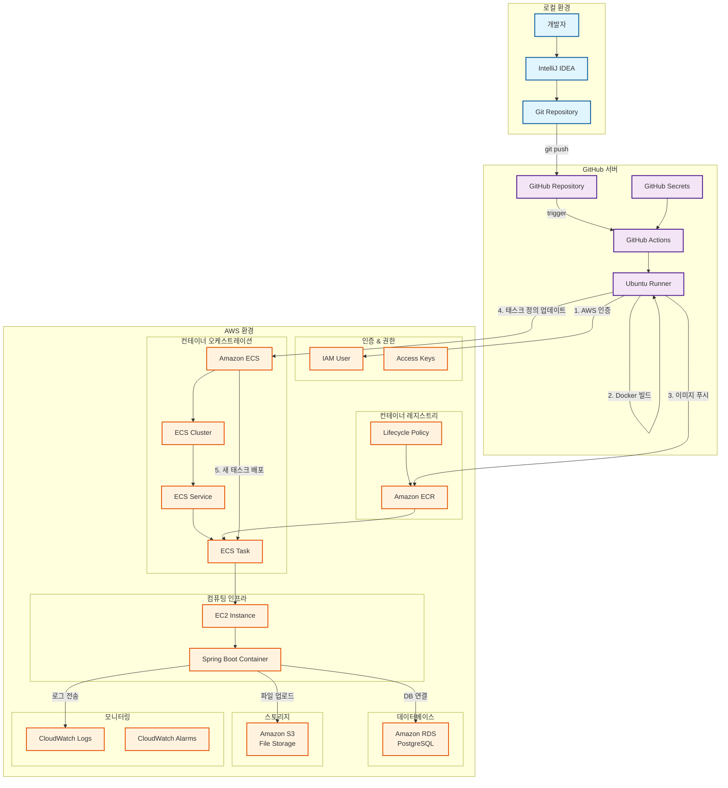

# Phase 4-1: CI/CD 자동화 파이프라인 구축

## 개요
Phase 3에서 완료한 Docker 컨테이너화와 ECS 배포 환경을 기반으로, GitHub Actions를 통한 CI/CD 자동화 파이프라인을 구축한다. 코드 변경 시 자동으로 빌드-배포되는 완전한 자동화 시스템을 구현한다.

---

## 1. GitHub Actions 시작하기

### 1-1. GitHub - 워크플로우 기본 설정
#### 1-1-1. GitHub Repository 준비

**GitHub에서 새 Repository 생성:**
1. **GitHub 접속 후 로그인** -> [GitHub](https://github.com)
2. **새 레포지토리 생성**: 
   - 우측 상단 **+** 버튼 클릭 → **New repository** 선택
   - **Repository name**: `chap02-aws-deploy` 입력
   - **Description** (선택사항): `AWS ECS deployment with CI/CD` 입력
   - **Public/Private 설정**: **Public** 선택 
     - GitHub Actions 무료 사용량이 Public 레포지토리에서 더 많음
     - 학습 목적이므로 Public으로 설정하는 것을 권장
   - **Initialize this repository with**: 모든 체크박스 **해제**
     - README, .gitignore, License 모두 체크하지 않고 빈 레포지토리로 생성
   - **Create repository** 버튼 클릭

3. **레포지토리 URL 복사**: 생성된 레포지토리 페이지에서 URL 복사
   - **Code** 버튼 클릭 → **SSH** 탭 선택 (SSH 인증 설정 완료한 경우)
   - SSH URL 복사: `git@github.com:{본인계정명}/chap02-aws-deploy.git`
   - SSH 설정이 안 된 경우 **HTTPS** 탭에서 복사: `https://github.com/{본인계정명}/chap02-aws-deploy.git`

**로컬 Git Repository 초기화:**
```bash
# 현재 기본 브랜치명 확인 (아무것도 출력되지 않는다면 master로 설정된 것)
git config --global init.defaultBranch

# 기본 브랜치명이 master로 설정되어 있다면 main으로 변경
# 이후 위 명령어를 다시 실행했을 때 출력되는 브랜치명이 main으로 변경되었는지 확인
git config --global init.defaultBranch main

# 현재 디렉토리를 Git Repository로 초기화
git init

# 원격 저장소 URL을 origin이라는 이름으로 등록
# 1. SSH 인증 설정된 경우 :
git remote add origin git@github.com:{사용자명}/chap02-aws-deploy.git
# 2. 또는 HTTPS 사용하는 경우:
git remote add origin https://github.com/{사용자명}/chap02-aws-deploy.git

# 원격 저장소 연결 확인
# 혹시라도 Permission denied (publickey). 라는 에러가 발생하면 GitHub 계정 설정에서 SSH 키를 등록하고 다시 시도한다.
git remote show origin
```

#### 1-1-2. 보안을 위한 .gitignore 설정 확인

**CI/CD 환경에서 중요한 .gitignore 항목들:**
Phase 4 진행 전 `.gitignore` 파일에 다음 보안 항목들이 포함되어 있는지 반드시 확인한다:

```gitignore
### 환경변수 및 설정 파일 (보안상 중요!) ###
.env
.env.*
!.env.example
application-*.yml
!application-local.yml
!application-aws.yml

### AWS 관련 민감 파일들 ###
*.pem
*.key
aws-credentials.txt
.aws/
credentials
config

### Docker 관련 ###
docker-compose.override.yml
*.log

### Spring Boot 관련 ###
logs/
application.properties
application-*.properties

### 파일 업로드 디렉토리 ###
uploads/
files/
images/
temp/

### OS별 시스템 파일들 ###
.DS_Store          # macOS
Thumbs.db          # Windows
Desktop.ini        # Windows

### 학습용 임시 파일들 ###
TODO.md
NOTES.md
memo.txt
test-*.txt

### 실습 가이드 파일들 (교육용 자료) ###
HOWTO-PHASE-*.md
```

> **⚠️ 보안 주의사항:**
> 
> **절대 GitHub에 올리면 안 되는 파일들:**
> - **AWS 자격증명**: 액세스 키, 시크릿 키, IAM 사용자 정보
> - **데이터베이스 비밀번호**: RDS 연결 정보
> - **SSH 키 파일**: EC2 접속용 .pem 파일
> - **실제 운영 환경 설정**: 실제 값이 포함된 application-prod.yml 등
> 
> **GitHub에 업로드해도 되는 파일들:**
> - **템플릿 파일**: .env.example (실제 값 없이 구조만)
> - **로컬 개발 설정**: application-local.yml (로컬 환경용)
> - **AWS 템플릿 설정**: application-aws.yml (환경변수 참조만 포함)

#### 1-1-3. GitHub에 프로젝트 업로드

**푸쉬 전 사전 확인 및 안전한 업로드:**
```bash
# 1단계: Git 상태 사전 확인 - 어떤 파일들이 추가될지 미리 점검
git status

# 2단계: .gitignore가 제대로 작동하는지 확인
git check-ignore .env
git check-ignore *.pem
git check-ignore application-prod.yml
git check-ignore HOWTO-PHASE-*.md
# 위 명령어들이 해당 파일명을 출력하면 올바르게 무시된 것이다.

# 3단계: 모든 파일을 스테이징 영역에 추가 (추적 대상으로 설정)
git add .

# 4단계: 추가된 파일들 최종 확인 - 민감한 파일이 포함되지 않았는지 점검
git status

# 5단계: 첫 번째 커밋 생성 (로컬 저장소에 변경사항 기록)
git commit -m "initial commit"

# 6단계: 기본 브랜치명을 main으로 변경 (GitHub 표준)
git branch -M main

# 7단계: 로컬 main 브랜치를 원격 저장소로 푸쉬하고 추적 관계 설정
# SSH 인증으로 인해 별도 로그인 과정 없이 자동으로 푸쉬됨
git push -u origin main
```

**만약 실수로 민감한 파일이나 불필요한 파일을 이미 커밋했다면:**
```bash
# 파일을 Git 추적에서 제거 (로컬 파일은 유지)
git rm --cached .env
git rm --cached *.pem
git rm --cached HOWTO-PHASE-*.md

# .gitignore 수정 후 다시 커밋
git add .gitignore
git commit -m "Remove sensitive/unnecessary files and update .gitignore"
git push origin main

# ⚠️ 중요: AWS 콘솔에서 노출된 액세스 키 즉시 비활성화/삭제 필요
```

#### 1-1-4. 워크플로우 디렉토리 생성

**워크플로우 디렉토리 생성:**
1. **IntelliJ IDEA에서 디렉토리 구조 생성**:
   - 프로젝트 루트에서 우클릭 → **New** → **Directory**
   - 디렉토리 이름: `.github` 입력 후 **Enter**
   - `.github` 폴더에서 우클릭 → **New** → **Directory**
   - 디렉토리 이름: `workflows` 입력 후 **Enter**
   - 최종 구조: `.github/workflows/`

2. **워크플로우 파일 생성**:
   - `workflows` 폴더에서 우클릭 → **New** → **File**
   - 파일 이름: `deploy.yml` 입력 후 **Enter**
   - 이 파일에 GitHub Actions 워크플로우를 정의할 예정

> **💡 워크플로우 파일명 및 확장자 규칙:**
> 
> **반드시 지켜야 하는 것:**
> - **위치**: `.github/workflows/` 폴더 안에 위치해야 함
> - **확장자**: `.yml` 또는 `.yaml` (둘 다 가능)
> 
> **자유롭게 변경 가능한 것:**
> - **파일명**: 의미있는 이름으로 자유롭게 설정 가능
> 
> **파일명 예시:**
> ```
> ✅ 가능한 파일명들:
> - deploy.yml
> - deploy.yaml
> - ci-cd.yml
> - aws-deploy.yaml
> - main-deploy.yml
> - production-deployment.yaml
> - build-and-deploy.yml
> 
> ❌ 불가능한 파일명들:
> - deploy.json (확장자 불일치)
> - deploy.txt (확장자 불일치)
> - deploy (확장자 없음)
> ```
> 
> **실무에서 자주 사용하는 명명 규칙:**
> - **기능별**: `build.yml`, `test.yml`, `deploy.yml`
> - **환경별**: `deploy-dev.yml`, `deploy-prod.yml`
> - **플랫폼별**: `deploy-aws.yml`, `deploy-azure.yml`
> - **통합형**: `ci-cd.yml`, `main.yml`

#### 1-1-5. 워크플로우 파일 기본 구조

**💡 GitHub Actions 워크플로우 개념 소개**

GitHub Actions는 GitHub 저장소에서 발생하는 **이벤트**(push, pull request 등)에 반응하여 자동으로 실행되는 작업을 정의할 수 있는 CI/CD 플랫폼이다. 워크플로우 파일은 이러한 자동화 작업을 YAML 형식으로 정의한다.

**워크플로우의 핵심 구성 요소:**
```yaml
# 워크플로우의 기본 구조
name: 워크플로우 이름         # GitHub UI에서 표시될 이름
on: 트리거 조건               # 언제 실행할지 정의
jobs:                         # 실행할 작업들
  작업이름:                   # 개별 작업 (여러 개 가능)
    runs-on: 실행환경         # Ubuntu, Windows, macOS 등
    steps:                    # 순차 실행할 단계들
    - name: 단계이름1         # 각 단계의 설명
      uses: 액션이름          # 미리 만들어진 액션 사용
    - name: 다른단계2
      run: 명령어             # 직접 명령어 실행
```

**이번 실습에서 사용할 주요 YAML 문법:**
- **name** : 워크플로우나 단계의 이름을 지정
- **on** : 워크플로우 실행 조건 (push, pull_request 등)
- **jobs** : 병렬 또는 순차 실행할 작업들
- **runs-on** : 가상머신 환경 (ubuntu-latest, windows-latest 등)
- **steps** : 작업 내에서 순차 실행할 단계들
- **uses** : GitHub Marketplace의 기존 액션 사용
- **run** : 셸 명령어 직접 실행
- **with** : 액션에 전달할 매개변수
- **env** : 환경변수 설정
- **${{ }}** : GitHub 컨텍스트나 Secret(뒤에서 다룰 것) 값 참조

**기본 워크플로우 작성 및 테스트:**
1. **deploy.yml 파일에 기본 구조 작성**:
   - 생성한 `deploy.yml` 파일을 IntelliJ IDEA에서 열기
   - 아래 기본 구조 코드를 복사-붙여넣기 하여 시작하자
   - 참고로, 이 워크플로우는 아직 완성되지 않았다. 완성된 워크플로우는 아래 2-1-2 단계에서 작성한다.

**실습용 기본 워크플로우 구조:**
```yaml
# name: GitHub Actions UI에서 표시될 워크플로우 이름
name: Deploy to AWS ECS

# on: 워크플로우 실행 트리거 조건
on:
  push:                      # Git push 이벤트 시 실행
    branches: [ main ]       # main 브랜치에 푸쉬할 때만

# jobs: 실행할 작업들 (여러 개 정의 가능)
jobs:
  deploy:                    # 작업 이름 (임의로 정할 수 있음)
    runs-on: ubuntu-latest   # 실행 환경 (GitHub가 제공하는 가상머신임)
    
    # steps: 이 작업에서 순차 실행할 단계들
    steps:
    # uses: 미리 만들어진 액션 사용 (GitHub Marketplace)
    - uses: actions/checkout@v3  # 1단계 : GitHub에 푸쉬된 우리의 소스코드를 가상머신에 다운로드하여 준다.
    
    # name: 단계에 이름 부여 (선택사항이지만 가독성 향상)
    - name: Setup JDK 17
      uses: actions/setup-java@v3    # 2단계 : Java 설치 액션
      # with: 액션에 전달할 매개변수들
      with:
        java-version: '17'           # 2-1단계 : Java 버전
        distribution: 'temurin'      # 2-2단계 : OpenJDK 배포판
```

> **💡 위 예제에서 사용된 문법 설명:**
> - `name: Deploy to AWS ECS`: UI에서 "Deploy to AWS ECS"로 표시됨
> - `on: push: branches: [ main ]`: main 브랜치에 push 시에만 실행
> - `runs-on: ubuntu-latest`: 최신 Ubuntu 가상머신에서 실행
> - `uses: actions/checkout@v3`: GitHub이 공식 제공하는 체크아웃 액션 사용
> - `with:`: 액션에 전달할 설정값들을 키-값 쌍으로 정의

### 1-2. GitHub - AWS 연동 설정
#### 1-2-1. GitHub Secrets 설정

**GitHub Secrets 보안 특징:**
GitHub Secrets는 민감한 정보를 안전하게 저장하는 기능으로 다음과 같은 보안 특징을 가진다:

- **암호화 저장** : 모든 Secret 값은 암호화되어 GitHub 서버에 저장됨
- **접근 권한 제한** : Repository 소유자와 Admin 권한자만 Secret 값을 보고 수정 가능
- **자동 마스킹** : GitHub Actions 로그에서 Secret 값이 자동으로 `***`로 표시됨
- **Fork 보호** : 퍼블릭 레포지토리를 Fork해도 원본의 Secrets에 접근할 수 없음
- **외부 PR 차단** : 외부 기여자의 Pull Request에서는 Secrets 접근이 기본적으로 차단됨

> **💡 실습 환경 권장사항:**
> 실습 환경에서는 각자 개별 레포지토리를 생성하여 자신의 AWS 자격증명을 Secrets로 관리하는 것이 가장 안전하다.

**GitHub Repository에서 Secrets 설정:**
1. **GitHub 레포지토리 Settings 접근**:
   - GitHub에서 생성한 `chap02-aws-deploy` 레포지토리로 이동
   - 상단 메뉴에서 **Settings** 탭 클릭
   - 좌측 사이드바에서 **Secrets and variables** 클릭
   - **Actions** 선택

2. **AWS 자격 증명 Secrets 추가**:
   - Environment secret과 Repository secret 중, Repository secret을 사용하자.
   - **New repository secret** 버튼 클릭
   - 다음 정보를 하나씩 추가 (총 10개):

   **첫 번째 Secret**:
   - **Name**: `AWS_ACCESS_KEY_ID`
   - **Secret**: Phase 2에서 생성한 IAM 사용자의 액세스 키 ID 입력
   - **Add secret** 클릭

   **두 번째 Secret**:
   - **Name**: `AWS_SECRET_ACCESS_KEY`
   - **Secret**: Phase 2에서 생성한 IAM 사용자의 시크릿 액세스 키 입력
   - **Add secret** 클릭

   **세 번째 Secret**:
   - **Name**: `AWS_REGION`
   - **Secret**: `ap-northeast-2` (서울 리전)
   - **Add secret** 클릭

   **네 번째 Secret**:
   - **Name**: `ECR_REPOSITORY`
   - **Secret**: `chap02-aws-deploy`
   - **Add secret** 클릭

   **다섯 번째 Secret**:
   - **Name**: `ECS_CLUSTER`
   - **Secret**: `chap02-ecs-cluster`
   - **Add secret** 클릭

   **여섯 번째 Secret**:
   - **Name**: `ECS_SERVICE`
   - **Secret**: `chap02-service`
   - **Add secret** 클릭

   **일곱 번째 Secret**:
   - **Name**: `ECS_TASK_DEFINITION`
   - **Secret**: `chap02-task-definition`
   - **Add secret** 클릭

   **여덟 번째 Secret** (애플리케이션용 AWS 자격증명):
   - **Name**: `APP_AWS_ACCESS_KEY_ID`
   - **Secret**: Phase 2에서 생성한 IAM 사용자의 액세스 키 ID 입력 (첫 번째와 동일한 값)
   - **Add secret** 클릭

   **아홉 번째 Secret** (애플리케이션용 AWS 자격증명):
   - **Name**: `APP_AWS_SECRET_ACCESS_KEY`
   - **Secret**: Phase 2에서 생성한 IAM 사용자의 시크릿 액세스 키 입력 (두 번째와 동일한 값)
   - **Add secret** 클릭

   **열 번째 Secret** (데이터베이스 접근용):
   - **Name**: `RDS_PASSWORD`
   - **Secret**: `PostgresAdmin123!` (Phase 3에서 설정한 RDS 비밀번호)
   - **Add secret** 클릭

**💡 Phase 3 ECS 환경변수 vs Phase 4 GitHub Secrets 차이점:**

Phase 3에서는 ECS 태스크 정의에 10개의 환경변수를 설정했는데, 여기서는 왜 7개의 GitHub Secrets만 설정하는지 궁금할 것이다. 이 둘은 **근본적으로 다른 목적과 레이어**에서 사용되는 설정이다:

**Phase 3 - ECS 태스크 환경변수 (10개) - 애플리케이션 레이어:**
```
용도: Spring Boot 애플리케이션이 런타임에 사용
사용 주체: 컨테이너 내부에서 실행되는 Java 애플리케이션

1. SPRING_PROFILES_ACTIVE: aws          # Spring Boot 프로파일
2. AWS_REGION: ap-northeast-2           # 앱이 AWS API 호출시 사용
3. STORAGE_TYPE: s3                     # 앱의 파일 저장 방식
4. AWS_ACCESS_KEY_ID: AKIA...           # 앱이 S3/RDS 접근용
5. AWS_SECRET_ACCESS_KEY: KEY=...       # 앱이 S3/RDS 접근용
6. AWS_S3_BUCKET: menu-images-2025...   # 앱이 파일 업로드할 S3 버킷
7. RDS_ENDPOINT: menu-management-db...  # 앱이 DB 연결시 사용
8. RDS_DATABASE: menudb                 # 앱이 접속할 DB명
9. RDS_USERNAME: postgres               # 앱의 DB 로그인 계정
10. RDS_PASSWORD: PostgresAdmin123!     # 앱의 DB 로그인 비밀번호
```

**Phase 4 - GitHub Secrets (10개) - 인프라/배포 + 애플리케이션 레이어:**
```
용도: CI/CD 파이프라인 + 애플리케이션 실행 시 사용
사용 주체: GitHub Actions 워크플로우 + 배포된 컨테이너

== 인프라/배포 레이어 (7개) ==
1. AWS_ACCESS_KEY_ID                   # GitHub Actions 서버가 AWS 서버에 접근하기 위한 인증용
2. AWS_SECRET_ACCESS_KEY               # GitHub Actions 서버가 AWS 서버에 접근하기 위한 인증용
3. AWS_REGION                          # GitHub Actions 서버가 AWS API 호출시 사용하는 리전
4. ECR_REPOSITORY: chap02-aws-deploy   # 도커 이미지 업로드할 ECR 저장소명
5. ECS_CLUSTER: chap02-ecs-cluster     # 배포할 ECS 클러스터명
6. ECS_SERVICE: chap02-service         # 업데이트할 ECS 서비스명
7. ECS_TASK_DEFINITION: chap02-task... # 배포할 ECS 태스크 정의명

== 애플리케이션 레이어 (3개) ==
8. APP_AWS_ACCESS_KEY_ID               # 애플리케이션이 S3에 접근하기 위한 인증용
9. APP_AWS_SECRET_ACCESS_KEY           # 애플리케이션이 S3에 접근하기 위한 인증용
10. RDS_PASSWORD                       # 애플리케이션이 데이터베이스 연결시 사용
```

**역할 분담:**
- **GitHub Actions**: "내가 Docker 이미지 빌드해서 ECR에 푸쉬하고, ECS 서비스를 업데이트해야지!"
- **Spring Boot 앱**: "내가 S3에 파일 올리고, RDS에 데이터 저장해야지!"

**보안 관점:**
- **GitHub Secrets**: CI/CD 파이프라인만 접근 가능하도록 설정
- **ECS 환경변수**: 실행 중인 컨테이너만 접근 가능하도록 설정

3. **Secrets 설정 완료 확인**:
   - Actions secrets 페이지에서 10개의 secret이 모두 등록되었는지 확인하자.
   - Secret 값은 보안상 표시되지 않고 이름만 보임.
   - 혹시라도 수정하고 싶다면 기존에 입력했던 값은 보이지 않고 무조건 새로 입력해야 한다.

> **💡 중복된 AWS 자격증명 값에 대한 설명:**
> - `AWS_ACCESS_KEY_ID`와 `APP_AWS_ACCESS_KEY_ID`는 **동일한 값**이지만 **다른 용도**입니다
> - `AWS_SECRET_ACCESS_KEY`와 `APP_AWS_SECRET_ACCESS_KEY`도 **동일한 값**이지만 **다른 용도**입니다
> - **GitHub Actions용 (AWS_*)**: 배포 과정에서 ECR, ECS 조작
> - **애플리케이션용 (APP_AWS_*)**: 실행 중인 앱이 S3 접근


> **💡 시크릿 보안 관리 방법:**
> - IAM 사용자에게 최소 권한만 부여하기
> - 정기적인 액세스 키 로테이션하기
> - Secrets는 절대 코드에 하드코딩하지 않기

#### 1-2-2. AWS 연동 테스트

**테스트용 워크플로우 파일 생성:**
1. **새 워크플로우 파일 생성**:
   - `.github/workflows/` 폴더에서 우클릭 → **New** → **File**
   - 파일 이름: `test-aws-connection.yml` 입력 후 **Enter**
   > **💡 참고**: 파일명을 `test-connection.yaml`이나 `aws-test.yml` 등으로 변경해도 무방하다.

2. **테스트 워크플로우 코드 작성**:
   - 생성한 `test-aws-connection.yml` 파일에 아래 코드 복사-붙여넣기
   - **Ctrl+S** 또는 **Cmd+S**로 저장

**간단한 연동 테스트 워크플로우:**
```yaml
# 테스트용 워크플로우 이름
name: Test AWS Connection

# 트리거 조건 정의
on:
  # GitHub Actions UI에서 수동으로 해당 워크플로우를 실행할 수 있게 하는 트리거
  workflow_dispatch:

# 실행할 작업들 정의
jobs:
  # test라는 이름의 작업
  test:
    # Ubuntu 최신 버전에서 실행
    runs-on: ubuntu-latest
    
    # 실행할 단계들
    steps:
    # 1단계: AWS 자격 증명 설정 단계
    - name: Configure AWS credentials
      # AWS에서 제공하는 자격 증명 설정 액션 사용
      uses: aws-actions/configure-aws-credentials@v2
      # 액션에 전달할 설정값들
      with:
        # GitHub Secrets에 저장된 AWS 액세스 키 ID 사용
        aws-access-key-id: ${{ secrets.AWS_ACCESS_KEY_ID }}
        # GitHub Secrets에 저장된 AWS 시크릿 액세스 키 사용
        aws-secret-access-key: ${{ secrets.AWS_SECRET_ACCESS_KEY }}
        # GitHub Secrets에 저장된 AWS 리전 정보 사용
        aws-region: ${{ secrets.AWS_REGION }}
    
    # 2단계: AWS CLI를 사용한 연결 테스트 단계
    - name: Test AWS CLI
      # 직접 셸 명령어를 실행 (|를 사용하여 멀티라인 명령어를 작성할 수 있다)
      run: |
        # 2-1단계: 현재 AWS 계정 정보 확인 (자격 증명이 올바른지 테스트)
        aws sts get-caller-identity
        # 2-2단계: ECR 저장소 존재 여부 확인 (ECR 접근 권한 테스트)
        aws ecr describe-repositories --repository-names ${{ secrets.ECR_REPOSITORY }}
```

**테스트 워크플로우 실행 및 확인:** 이제 워크플로우 파일을 작성했으니 실제로 작동하는지 확인해보자.
1. **Git으로 테스트 워크플로우만 커밋 및 푸쉬**:
   - 터미널에서 프로젝트 루트로 이동
   - 다음 명령어 실행:
```bash
# 테스트 워크플로우 파일만 Git에 추가 (deploy.yml은 아직 추가하지 않는다!)
git add .github/workflows/test-aws-connection.yml

# 변경사항 커밋
git commit -m "Add AWS connection test workflow"

# GitHub로 푸쉬 (SSH 인증으로 자동 인증)
git push origin main
```

> **💡 왜 deploy.yml은 아직 추가하지 않나?**
> - `task-definition.json` 파일이 아직 생성되지 않음
> - 완전한 워크플로우 내용이 미완성 상태
> - 의도치 않은 배포 실행 방지
> - 단계별 안전한 학습을 위해

2. **GitHub Actions에서 수동 실행**:
   - GitHub 저장소로 이동
   - 상단 메뉴에서 **Actions** 탭 클릭
   - 좌측에서 **Test AWS Connection** 워크플로우 선택
   - **Run workflow** 버튼 클릭
   - **Run workflow** 드롭다운에서 **Run workflow** 다시 클릭

3. **실행 결과 확인**:
   - 워크플로우 실행 상태를 실시간으로 모니터링
   - **Configure AWS credentials** 단계가 성공하면 AWS 연동 완료
   - **Test AWS CLI** 단계가 성공하면 모든 권한 설정 완료
   - 실패 시 로그를 확인하여 어떤 Secret이 잘못되었는지 파악

**✅ 5단계 실행 결과 분석:**

1. **Set up job (1s)** - 가상머신 환경 준비
   ```
   Runner Image: ubuntu-24.04
   Operating System: Ubuntu 24.04.2 LTS
   ```
   ➜ GitHub Actions 서버가 제공하는 Ubuntu 가상머신이 성공적으로 시작되었음을 의미한다.

2. **Configure AWS credentials (1s)** - AWS 인증 설정
   ```
   aws-access-key-id: ***
   aws-secret-access-key: ***
   aws-region: ***
   ```
   ➜ GitHub Secrets의 AWS 자격증명이 정상적으로 가상머신에 설정되었음을 의미한다.

3. **Test AWS CLI (6s)** - AWS 연결 테스트
   ```
   # 2-1단계 결과:
   {
       "UserId": "${AWS 액세스 키 ID}",
       "Account": "${AWS 계정 ID}",
       "Arn": "${AWS 계정 ARN}"
   }
   
   # 2-2단계 결과:
   {
       "repositories": [
           {
               "repositoryName": "***",
               "repositoryUri": "***.dkr.ecr.***.amazonaws.com/***",
               "createdAt": "2025-06-27T02:30:55.464000+00:00"
           }
       ]
   }
   ```
   ➜ AWS 계정 정보 조회 성공 + ECR 저장소 접근 성공 = 모든 권한이 정상임을 의미한다.

4. **Post Configure AWS credentials (0s)** - AWS 인증 정리
   ➜ 보안을 위해 임시로 설정된 AWS 자격증명을 가상머신에서 제거하였음을 의미한다.

5. **Complete job (0s)** - 작업 완료 및 정리
   ➜ 가상머신 정리 및 모든 프로세스 종료하였음을 의미한다.

**🎯 종합 결과**: GitHub Actions ↔ AWS 연동이 완벽하게 작동함을 확인할 수 있다.

4. **문제 해결 (실패 시)**:
   - **자격 증명 오류** : AWS_ACCESS_KEY_ID, AWS_SECRET_ACCESS_KEY 재확인
   - **권한 오류** : IAM 사용자 권한 설정 재확인 (ECR, ECS 권한 필요)
   - **리전 오류** : AWS_REGION이 ap-northeast-2인지 확인
   - **저장소 오류** : ECR 저장소가 실제로 존재하는지 AWS 콘솔에서 확인

---

## 2. 자동 배포 구성하기

### 2-1. 완전한 워크플로우 작성 (IntelliJ IDEA)
#### 2-1-1. ECR에 라이프사이클 규칙 추가하기

GitHub Actions 워크플로우는 매번 실행될 때마다 새로운 Docker 이미지를 ECR에 저장한다. 시간이 지나면서 이미지가 계속 누적되면 다음 문제들이 발생한다:

- **비용 증가** : ECR 프리티어는 월 500MB까지 무료, 초과 시 과금
- **저장소 관리 복잡성** : 불필요한 이전 버전들로 인한 관리 부담  
- **성능 저하** : 많은 이미지로 인한 ECR 조회 속도 감소

이때, 라이프사이클 정책을 설정하면 **자동으로 오래된 이미지를 삭제**하여 이러한 문제들을 해결할 수 있다.

**AWS 웹 콘솔에서 라이프사이클 정책 설정:**

1. **AWS 콘솔** → **ECR** 서비스로 이동
2. **리포지토리** → `chap02-aws-deploy` 저장소 클릭
3. **라이프사이클 정책** 탭 → **편집** 버튼 클릭
4. **수명 주기 테스트 규칙 생성** 페이지에서 다음과 같이 설정:

**규칙 우선 순위**: `1` 입력
**규칙 설명**: `최신 1개 이미지만 보관 (학습 환경용)` 입력

**이미지 상태**: 
- **태그 지정됨(와일드카드 일치)** 선택

**와일드카드 일치 위한 태그 지정**:
- `*` 입력 (모든 태그에 적용)

**매치 범위**:
- 첫 번째 드롭다운: **이미지가 푸시된 후** 선택  
- 개수 입력란: `1` 입력
- 참고로, 실무에서는 최대 3-5개 버전을 유지하여 빠른 롤백을 지원하지만, 학습 환경에서는 용량 절약을 위해 1개만 유지한다.

**규칙 작업**:
- **expire** (만료) 선택

**저장** 버튼 클릭하여 정책 저장

**설정 완료 후 동작:**
- 새 이미지가 푸시되면 1일 후 이전 이미지 자동 삭제
- 항상 최신 1개 이미지만 ECR에 유지
- 용량 절약 및 자동 관리로 수동 개입 불필요

> **💡 참고**: 실제 운영 환경에서는 보통 3-5개 버전을 유지하여 빠른 롤백을 지원하지만, 학습 환경에서는 용량 절약을 위해 1개만 유지한다.

#### 2-1-2. ECS 태스크 정의 파일 준비

**태스크 정의 파일이 필요한 이유:**
GitHub Actions에서 ECS에 자동 배포하려면 **어떤 컨테이너를 어떻게 실행할지**에 대한 정보가 필요하다. Phase 3에서 생성한 태스크 정의 파일(`task-definition.json`)은 이러한 컨테이너 실행 명세서 역할을 한다.

- **Phase 3에서의 배포**: AWS 콘솔에서 수동으로 태스크 정의 생성 → 서비스에서 실행
- **Phase 4에서의 배포**: GitHub Actions가 태스크 정의 파일을 읽어서 → 기존 이미지를 제거하고 새 이미지로 업데이트 → 자동 배포

즉, **현재 실행 중인 ECS 태스크 설정을 파일로 가져와서**, GitHub Actions가 **새 Docker 이미지만 교체**하여 배포하는 방식이다.

1. **AWS 콘솔에서 태스크 정의 다운로드**:
   - AWS 콘솔에서 **ECS** → **태스크 정의** → Phase 3에서 생성했던 `chap02-task-definition` 선택
   - **JSON** 탭에서 태스크 정의 내용을 우측의 **클립보드로 복사** 버튼을 클릭해 복사
   - 프로젝트 루트에 `task-definition.json` 파일 생성 후 붙여넣기
   - 참고로 JSON 파일을 다운로드 받아 프로젝트 루트에 저장하는 방법도 있다

2. **⚠️ 중요: 민감한 정보 및 불필요한 필드 제거 (보안상 필수)**:
   JSON 파일에서 다음 필드들을 **반드시 제거**해야 한다:
   ```json
   # 제거해야 할 필드들:
   "taskDefinitionArn": "...",           # 불필요한 필드
   "revision": 2,                        # 불필요한 필드
   "status": "ACTIVE",                   # 불필요한 필드
   "registeredAt": "...",                # 불필요한 필드
   "registeredBy": "...",                # 불필요한 필드
   "requiresAttributes": [...],          # 불필요한 필드
   "tags": [],                           # 불필요한 필드
   "enableFaultInjection": false,        # GitHub Actions 미지원 필드 (중요!)
   ```
   특히, 아래 환경변수들은 제거하지 않으면 해당 `task-definition.json` 파일이 GitHub에 올라갈 것이고 이 파일을 통해 민감한 정보가 노출될 수 있다.
   ```json
   {
     "name": "AWS_ACCESS_KEY_ID",
     "value": "XXXX..."                  # 삭제 필요!
   },
   {
     "name": "AWS_SECRET_ACCESS_KEY", 
     "value": "XXXX..."                  # 삭제 필요!
   }
   ```

> 💡참고로 원래는 `RDS_PASSWORD` 값도 제거하는 것이 안전하지만, 우리는 앞서 Phase3에서 내 IP로만 RDS에 접속할 수 있도록 보안 그룹 설정을 해 놓았으므로 해당 실습에서는 제거하지 않았다.
> 만약 이 마저도 감추고 싶다면 GitHub Secrets에 등록해 `deploy.yml`에 환경 변수로 주입하는 방법도 고려해볼 수 있다.

> **💡 민감한 환경변수는 어떻게 처리되나?**
> 
> **제거된 민감한 환경변수들 (AWS_ACCESS_KEY_ID, AWS_SECRET_ACCESS_KEY, RDS_PASSWORD)은 실제 ECS 배포 시점에 GitHub Actions가 자동으로 현재 실행 중인 태스크 정의에서 가져와서 새 태스크 정의에 병합한다.**
> 
> 즉, GitHub Actions는 다음과 같은 작업을 자동으로 수행한다:
> 1. 현재 실행 중인 태스크 정의의 환경변수 보존
> 2. 새 이미지 URL만 업데이트 
> 3. 민감한 정보 유지하면서 배포

#### 2-1-3. Docker 빌드 및 ECR 업로드 자동화

**완전한 deploy.yml 파일 작성:**
아래 내용을 복사-붙여넣기 하여 `deploy.yml` 파일을 완성하자.
```yaml
# 프로덕션 배포용 워크플로우 이름
name: Deploy to AWS ECS

# 트리거 조건: main 브랜치에 푸쉬 시 자동 실행
on:
  push:
    branches: [ main ]

# 워크플로우 전체에서 사용할 환경 변수 정의
env:
  # AWS 리전 (서울)
  AWS_REGION: ap-northeast-2
  # ECR 저장소 이름
  ECR_REPOSITORY: chap02-aws-deploy
  # ECS 서비스 이름
  ECS_SERVICE: chap02-service
  # ECS 클러스터 이름
  ECS_CLUSTER: chap02-ecs-cluster
  # ECS 태스크 정의 이름
  ECS_TASK_DEFINITION: chap02-task-definition

jobs:
  # 배포 작업 정의
  deploy:
    # GitHub Actions UI에서 표시될 작업 이름
    name: Deploy
    # Ubuntu 최신 버전에서 실행
    runs-on: ubuntu-latest

    # 배포 작업의 실행 단계들
    steps:
    # 1단계: 소스코드 체크아웃
    - name: Checkout
      # GitHub Actions 서버에서 제공하는 소스코드 체크아웃 액션 사용
      uses: actions/checkout@v3

    # 2단계: Java 17 개발 환경 설정
    - name: Set up JDK 17
      # GitHub Actions 서버에서 제공하는 JDK 설정 액션 사용
      uses: actions/setup-java@v3
      with:
        java-version: '17'
        distribution: 'temurin'

    # 3단계: AWS 자격 증명 설정
    - name: Configure AWS credentials
      # GitHub Actions 서버에서 제공하는 AWS 자격 증명 설정 액션 사용
      uses: aws-actions/configure-aws-credentials@v2
      with:
        # secrets.: GitHub Secrets에 등록된 AWS 자격 증명 정보 가져오기
        aws-access-key-id: ${{ secrets.AWS_ACCESS_KEY_ID }}
        aws-secret-access-key: ${{ secrets.AWS_SECRET_ACCESS_KEY }}
        # env.: 위에서 설정한 환경 변수로부터 리전 정보 가져오기
        aws-region: ${{ env.AWS_REGION }}

    # 4단계: Amazon ECR에 로그인
    - name: Login to Amazon ECR
      # 이 단계의 출력값을 다른 단계에서 사용하기 위한 ID 설정(일종의 변수화)
      id: login-ecr
      # AWS에서 제공하는 ECR 로그인 액션 사용
      uses: aws-actions/amazon-ecr-login@v1

    # 5단계: Docker 이미지 빌드 및 ECR에 업로드
    - name: Build, tag, and push image to Amazon ECR
      # 이 단계의 출력값을 다른 단계에서 사용하기 위한 ID 설정
      id: build-image
      # 이 단계에서만 사용할 환경 변수 정의
      env:
        # 이전 단계(login-ecr)의 출력값에서 ECR 레지스트리 URL 가져오기
        ECR_REGISTRY: ${{ steps.login-ecr.outputs.registry }}
        # Git 커밋 해시를 이미지 태그로 사용 (고유성 보장)
        IMAGE_TAG: ${{ github.sha }}
      # 셸 명령어 직접 실행
      run: |
        # gradlew 파일에 실행 권한 부여 (Linux/Unix 시스템 필수)
        # GitHub Actions 서버는 Linux/Unix 시스템이므로 이 명령어를 넣어줘야 실행 권한이 부여된다.
        chmod +x ./gradlew
        # Spring Boot 애플리케이션을 JAR 파일로 빌드
        ./gradlew bootJar
        
        # Docker 이미지를 한 번만 빌드하고 두 개의 태그 적용 (ECR 프리티어 500MB 제한)
        docker build -t $ECR_REGISTRY/$ECR_REPOSITORY:$IMAGE_TAG -t $ECR_REGISTRY/$ECR_REPOSITORY:latest .
        
        # ECR에 이미지 푸쉬 (커밋 해시 태그) - 실제 이미지 업로드
        docker push $ECR_REGISTRY/$ECR_REPOSITORY:$IMAGE_TAG
        # ECR에 이미지 푸쉬 (latest 태그) - 태그만 추가로 푸쉬 (용량 추가 없음)
        docker push $ECR_REGISTRY/$ECR_REPOSITORY:latest
        
        # 다음 단계에서 사용할 수 있도록 빌드된 이미지 정보를 출력
        # 이 단계의 출력값을 다른 단계에서 사용하기 위한 ID 설정 (GITHUB_OUTPUT가 변수화됨)
        echo "image=$ECR_REGISTRY/$ECR_REPOSITORY:$IMAGE_TAG" >> $GITHUB_OUTPUT

    # 6단계: 태스크 정의 파일에서 컨테이너 이미지 정보를 새 이미지로 업데이트
    - name: Fill in the new image ID in the Amazon ECS task definition
      # 이 단계의 출력값을 다음 단계에서 사용하기 위한 ID 설정
      id: task-def
      # AWS에서 제공하는 태스크 정의 렌더링 액션 사용
      uses: aws-actions/amazon-ecs-render-task-definition@v1
      with:
        # 프로젝트 루트의 태스크 정의 JSON 파일 경로
        task-definition: task-definition.json
        # 업데이트할 컨테이너의 이름 (본인의 태스크 정의 파일 내 containerDefinitions에서 지정한 이름)
        container-name: chap02-container
        # 새로 빌드된 이미지 URL (이전 단계의 출력값 사용)
        image: ${{ steps.build-image.outputs.image }}
        # (보안!) GitHub Secrets에서 정의한 애플리케이션 레벨의 환경변수들을 동적으로 주입
        environment-variables: |
          AWS_ACCESS_KEY_ID=${{ secrets.APP_AWS_ACCESS_KEY_ID }}
          AWS_SECRET_ACCESS_KEY=${{ secrets.APP_AWS_SECRET_ACCESS_KEY }}
          RDS_PASSWORD=${{ secrets.RDS_PASSWORD }}

    # 7단계: 업데이트된 태스크 정의로 ECS 서비스 배포 실행
    - name: Deploy Amazon ECS task definition
      # AWS에서 제공하는 ECS 배포 액션 사용
      uses: aws-actions/amazon-ecs-deploy-task-definition@v1
      with:
        # 이전 단계에서 업데이트된 태스크 정의 사용
        task-definition: ${{ steps.task-def.outputs.task-definition }}
        # 업데이트할 ECS 서비스 이름
        service: ${{ env.ECS_SERVICE }}
        # 대상 ECS 클러스터 이름
        cluster: ${{ env.ECS_CLUSTER }}
        # 배포가 안정화될 때까지 기다리기 (true: 새 태스크가 완전히 실행되고 헬스체크 통과까지 대기)
        # 참고로 이 옵션을 사용하면 배포가 완료될 때까지 워크플로우가 대기하게 되며
        # CI/CD에서는 보통 false를 사용해 배포가 완료되면 다음 단계로 넘어가도록 설정한다.
                  wait-for-service-stability: true
```

**💡 위 워크플로우에서 사용된 GitHub Actions 참고 링크:**

워크플로우 파일에서 `uses`로 사용한 각 액션들의 공식 문서와 소스코드는 다음 링크에서 확인할 수 있다 학습할 때 참고하도록 하자:

- **actions/checkout@v3**: 소스코드 체크아웃
  - 📚 [공식 문서](https://github.com/actions/checkout)
  - 🔧 [사용법 가이드](https://github.com/actions/checkout#usage)

- **actions/setup-java@v3**: Java 개발 환경 설정
  - 📚 [공식 문서](https://github.com/actions/setup-java)
  - 🔧 [지원 버전 목록](https://github.com/actions/setup-java#supported-version-syntax)

- **aws-actions/configure-aws-credentials@v2**: AWS 자격 증명 설정
  - 📚 [공식 문서](https://github.com/aws-actions/configure-aws-credentials)
  - 🔧 [설정 옵션](https://github.com/aws-actions/configure-aws-credentials#credentials)

- **aws-actions/amazon-ecr-login@v1**: Amazon ECR 로그인
  - 📚 [공식 문서](https://github.com/aws-actions/amazon-ecr-login)
  - 🔧 [출력값 활용법](https://github.com/aws-actions/amazon-ecr-login#outputs)

- **aws-actions/amazon-ecs-render-task-definition@v1**: ECS 태스크 정의 렌더링
  - 📚 [공식 문서](https://github.com/aws-actions/amazon-ecs-render-task-definition)
  - 🔧 [환경변수 주입 방법](https://github.com/aws-actions/amazon-ecs-render-task-definition#environment-variables)

- **aws-actions/amazon-ecs-deploy-task-definition@v1**: ECS 서비스 배포
  - 📚 [공식 문서](https://github.com/aws-actions/amazon-ecs-deploy-task-definition)
  - 🔧 [배포 옵션](https://github.com/aws-actions/amazon-ecs-deploy-task-definition#inputs)

**추가 학습 자료:**
- [GitHub Actions 마켓플레이스](https://github.com/marketplace?type=actions) : 모든 공개 액션 검색
- [GitHub Actions 공식 문서](https://docs.github.com/en/actions) : 워크플로우 작성 가이드
- [AWS GitHub Actions](https://github.com/aws-actions) : AWS에서 공식 제공하는 모든 액션 모음

**완성된 워크플로우 파일 커밋:**
이제 `task-definition.json` 파일도 준비되었고 완전한 워크플로우가 작성되었으므로, 이제 민감한 정보들을 제거하고 안전하게 커밋할 수 있다.

- `task-definition.json` 파일이 생성됨
- 완전한 워크플로우 내용이 완성됨
- 모든 필수 구성 요소가 준비됨

```bash
# 완성된 deploy.yml과 task-definition.json을 Git에 추가
git add .github/workflows/deploy.yml
git add task-definition.json

# 변경사항 커밋
git commit -m "Add complete deploy workflow and task definition"

# GitHub로 푸쉬
git push origin main
```

이제 완성된 `deploy.yml` 파일을 GitHub에 푸쉬하면 다음 과정들이 자동으로 진행된다:

1. **GitHub Actions 자동 실행** : main 브랜치 푸쉬 감지로 즉시 워크플로우 시작
2. **새 태스크 정의 생성** : 기존 태스크 정의가 아닌, 새로운 태스크 정의를 적용한 것이므로 개정(revision) 번호가 하나 증가 (예: revision 2 → revision 3)
3. **ECS 서비스 업데이트** : 새 태스크 정의로 서비스가 업데이트되어 새 태스크 시작
4. **무한 대기 상황 발생** : 이미 우리는 Phase3에서 작업했던 정상 실행중인 태스크가 있으므로 이 태스크가 중지되어야 새 태스크가 실행될 수 있다. 그런데 `wait-for-service-stability: true` 로 설정했기 때문에 다음 조건까지 워크플로우가 무한 대기한다.
   - 새 태스크가 "프로비저닝" → "실행 중" 상태로 전환
   - 헬스체크 통과 완료
   - 기존 태스크 자동 중지
5. **기존 태스크 중지** : 따라서 기존 태스크를 중지시켜 새로운 태스크가 실행될 수 있도록 해야 한다. 이는 AWS 콘솔에서 직접 진행한다.
6. **워크플로우 완료** : 기존 태스크 중지 후 새 태스크가 정상 실행되면 워크플로우 완료

### 2-2. 자동된 배포 테스트

#### 2-2-1. 코드 변경 및 배포 테스트

**애플리케이션 코드 일부 수정:**
이제 일부 소스 코드를 수정한후 자동으로 배포되는지 확인해보자.
1. 메인 페이지 타이틀 변경 또는 API 응답 메시지 수정
2. Git 커밋 및 푸쉬:
```bash
# 변경된 모든 파일을 스테이징 영역에 추가
git add .
# 변경사항을 로컬 저장소에 커밋 (의미있는 커밋 메시지 작성)
git commit -m "Update application for deployment test"
# 로컬 main 브랜치의 변경사항을 원격 저장소로 푸쉬
# SSH 인증으로 인해 자동 인증되어 푸쉬됨
# 이 명령이 실행되면 GitHub Actions 워크플로우가 자동으로 트리거됨
git push origin main
```

**GitHub Actions 워크플로우 실행 확인:**
1. GitHub Repository → **Actions** 탭 확인
2. 워크플로우 실행 상태 모니터링
3. 각 스텝별 로그 확인

#### 2-2-2. 배포 결과 확인

**ECS 서비스 업데이트 상태 확인:**
1. AWS 콘솔 → **ECS** → **클러스터** → `chap02-ecs-cluster`
2. **서비스** 탭에서 `chap02-service` 배포 상태 확인
3. **이벤트** 탭에서 배포 진행 상황 모니터링

**새 버전 애플리케이션 동작 확인:**
```bash
# Spring Boot Actuator 헬스체크 엔드포인트 호출
# 애플리케이션과 데이터베이스 연결 상태 확인
curl http://{새로운퍼블릭IP}/actuator/health

# 메뉴 카테고리 API 호출
# 실제 비즈니스 로직이 정상 동작하는지 확인
curl http://{새로운퍼블릭IP}/api/categories
```

**전체 파이프라인 아키텍처:**



코드 변경 → GitHub 푸쉬 → 자동 빌드 → ECR 업로드 → ECS 배포 → 서비스 실행

---

## 체크포인트

Phase 4 완료 후 확인사항:
- [ ] **GitHub Actions 설정 완료**
  - [ ] GitHub Repository 및 워크플로우 설정 완료
  - [ ] GitHub Secrets 보안 설정 완료
  - [ ] AWS 연동 테스트 완료
- [ ] **자동 배포 파이프라인 완료**
  - [ ] Docker 빌드 자동화 완료
  - [ ] ECR 업로드 자동화 완료
  - [ ] ECS 배포 자동화 완료
  - [ ] 코드 변경 → 자동 배포 전체 흐름 테스트 완료
- [ ] **자동 배포 검증 완료**
  - [ ] 소스 코드 변경 후 자동 배포 테스트 완료
  - [ ] 새 버전 애플리케이션 정상 동작 확인 완료
  - [ ] 전체 CI/CD 파이프라인 동작 검증 완료

**최종 결과**: GitHub에서 코드를 푸쉬하면 자동으로 AWS ECS에 배포되는 완전한 CI/CD 파이프라인 구축 완성

---

## 작업 환경 구분 안내

- **IntelliJ IDEA**: 코드 수정, 워크플로우 파일 작성, Git 작업
- **터미널 (로컬)**: Git 명령어, 로컬 테스트, 부하 테스트
- **AWS 콘솔**: ECS, ECR 등 AWS 서비스 관리 (서울 리전 사용)
- **GitHub**: Repository 관리, Secrets 설정, Actions 모니터링

각 단계에서 어느 환경에서 작업해야 하는지 명확히 구분했으니, 작업 전 반드시 확인하자!
